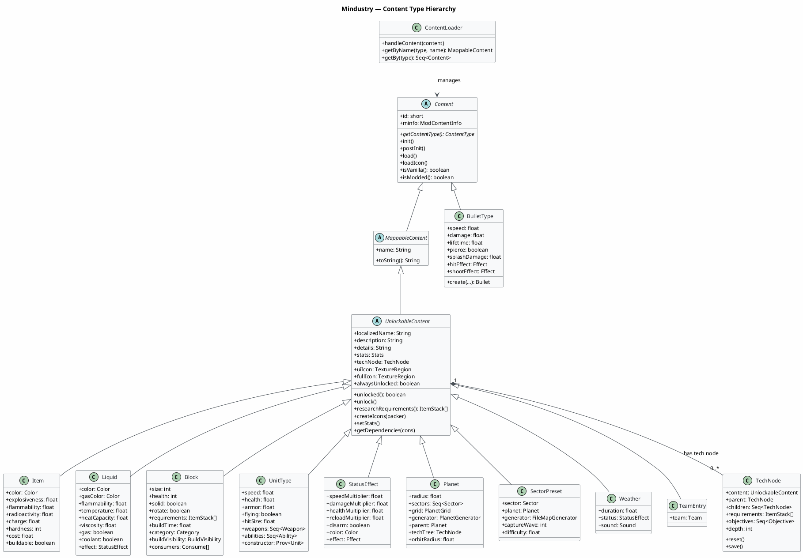

Looking at this large Mindustry codebase (1,421 classes), I'll produce four focused class diagrams covering the key architectural subsystems.

---

```plantuml
@startuml CoreGameArchitecture
skinparam classAttributeIconSize 0
skinparam shadowing false
skinparam defaultFontName "Segoe UI"
skinparam defaultFontSize 12
skinparam backgroundColor #FEFEFE
skinparam class {
    BackgroundColor #F8F9FA
    BorderColor #495057
    ArrowColor #495057
    FontColor #212529
}
skinparam package {
    BackgroundColor #E9ECEF
    BorderColor #6C757D
}

title Mindustry — Core Game Architecture

class Vars <<static>> {
    +{static} net: Net
    +{static} content: ContentLoader
    +{static} state: GameState
    +{static} world: World
    +{static} control: Control
    +{static} logic: Logic
    +{static} renderer: Renderer
    +{static} ui: UI
    +{static} netServer: NetServer
    +{static} netClient: NetClient
    +{static} platform: Platform
    +{static} mods: Mods
    +{static} maps: Maps
    +{static} pathfinder: Pathfinder
    +{static} controlPath: ControlPathfinder
    +{static} indexer: BlockIndexer
    +{static} spawner: WaveSpawner
    +{static} fogControl: FogControl
    +{static} player: Player
}

class Control {
    +saves: Saves
    +sound: SoundControl
    +input: InputHandler
    +playMap(map, rules)
    +playSector(sector)
    +update()
}

class Logic {
    +play()
    +reset()
    +runWave()
    +checkGameState()
    +gameOver(winner)
    +update()
}

class Renderer {
    +blocks: BlockRenderer
    +fog: FogRenderer
    +minimap: MinimapRenderer
    +lights: LightRenderer
    +pixelator: Pixelator
    +planets: PlanetRenderer
    +camerascale: float
    +draw()
    +update()
}

class UI {
    +menufrag: MenuFragment
    +hudfrag: HudFragment
    +chatfrag: ChatFragment
    +planet: PlanetDialog
    +research: ResearchDialog
    +schematics: SchematicsDialog
    +update()
}

class GameState {
    +wave: int
    +wavetime: float
    +map: Map
    +rules: Rules
    +teams: Teams
    +stats: GameStats
    +markers: MapMarkers
    +set(state)
    +isPaused(): boolean
    +isPlaying(): boolean
    +isCampaign(): boolean
    +getState(): State
}

class World {
    +tiles: Tiles
    +tileChanges: int
    +tile(x, y): Tile
    +build(x, y): Building
    +loadMap(map)
    +loadSector(sector)
    +resize(width, height)
    +isGenerating(): boolean
}

class ContentLoader {
    +createBaseContent()
    +createModContent()
    +init()
    +load()
    +items(): Seq<Item>
    +blocks(): Seq<Block>
    +units(): Seq<UnitType>
    +liquids(): Seq<Liquid>
    +byName(name): MappableContent
}

class Net {
    +host(port)
    +connect(ip, port)
    +disconnect()
    +send(object, reliable)
    +active(): boolean
    +server(): boolean
    +client(): boolean
}

class NetServer {
    +admins: Administration
    +clientCommands: CommandHandler
    +sendWorldData(player)
    +assignTeam(player)
    +update()
}

class NetClient {
    +connect(ip, port)
    +entitySnapshot(amount, data)
    +stateSnapshot(...)
    +sync()
    +update()
}

class Pathfinder {
    +getField(team, costType, fieldType): Flowfield
    +getTargetTile(tile, path): Tile
    +updateTile(tile)
    +start()
    +stop()
}

class ControlPathfinder {
    +getPathPosition(unit, dest, out)
    +updateTile(tile)
    +start()
    +stop()
}

class BlockIndexer {
    +getFlagged(team): Seq<Building>[]
    +getDamaged(team): Seq<Building>
    +findClosestOre(unit, item): Tile
    +findEnemyTile(team, x, y, range): Building
    +eachBlock(team, range, pred, cons)
}

class WaveSpawner {
    +spawnEnemies()
    +spawnUnit(group, x, y)
    +getSpawns(): Seq<Tile>
    +countSpawns(): int
    +isSpawning(): boolean
}

interface Platform {
    +getNet(): NetProvider
    +getUUID(): String
    +shareFile(file)
    +createScripts(): Scripts
}

class Mods {
    +load()
    +loadContent()
    +list(): Seq<LoadedMod>
    +getMod(name): LoadedMod
    +hasScripts(): boolean
}

class Maps {
    +all(): Seq<Map>
    +customMaps(): Seq<Map>
    +loadMap(file, custom): Map
    +importMap(file): Map
    +getNextMap(mode, prev): Map
}

enum State {
    paused
    playing
    menu
}

Vars ..> Control : uses
Vars ..> Logic : uses
Vars ..> Renderer : uses
Vars ..> UI : uses
Vars ..> NetServer : uses
Vars ..> NetClient : uses
Vars ..> GameState : uses
Vars ..> World : uses
Vars ..> ContentLoader : uses
Vars ..> Net : uses
Vars ..> Pathfinder : uses
Vars ..> ControlPathfinder : uses
Vars ..> BlockIndexer : uses
Vars ..> WaveSpawner : uses
Vars ..> Maps : uses
Vars ..> Mods : uses

Control ..> GameState : reads
Control ..> World : reads
Logic ..> GameState : updates
Logic ..> World : reads
Renderer ..> World : reads
NetServer ..> GameState : reads
NetClient ..> GameState : reads
GameState *-- State
GameState *-- Rules : contains
GameState *-- Teams : contains

@enduml
```

---

```plantuml
@startuml ContentTypeHierarchy
skinparam classAttributeIconSize 0
skinparam shadowing false
skinparam defaultFontName "Segoe UI"
skinparam defaultFontSize 12
skinparam backgroundColor #FEFEFE
skinparam class {
    BackgroundColor #F8F9FA
    BorderColor #495057
    ArrowColor #495057
    FontColor #212529
}
skinparam package {
    BackgroundColor #E9ECEF
    BorderColor #6C757D
}

title Mindustry — Content Type Hierarchy

abstract class Content {
    +id: short
    +minfo: ModContentInfo
    +{abstract} getContentType(): ContentType
    +init()
    +postInit()
    +load()
    +loadIcon()
    +isVanilla(): boolean
    +isModded(): boolean
}

abstract class MappableContent {
    +name: String
    +toString(): String
}

abstract class UnlockableContent {
    +localizedName: String
    +description: String
    +details: String
    +stats: Stats
    +techNode: TechNode
    +uiIcon: TextureRegion
    +fullIcon: TextureRegion
    +alwaysUnlocked: boolean
    +unlocked(): boolean
    +unlock()
    +researchRequirements(): ItemStack[]
    +createIcons(packer)
    +setStats()
    +getDependencies(cons)
}

class Item {
    +color: Color
    +explosiveness: float
    +flammability: float
    +radioactivity: float
    +charge: float
    +hardness: int
    +cost: float
    +buildable: boolean
}

class Liquid {
    +color: Color
    +gasColor: Color
    +flammability: float
    +temperature: float
    +heatCapacity: float
    +viscosity: float
    +gas: boolean
    +coolant: boolean
    +effect: StatusEffect
}

class Block {
    +size: int
    +health: int
    +solid: boolean
    +rotate: boolean
    +requirements: ItemStack[]
    +buildTime: float
    +category: Category
    +buildVisibility: BuildVisibility
    +consumers: Consume[]
}

class UnitType {
    +speed: float
    +health: float
    +armor: float
    +flying: boolean
    +hitSize: float
    +weapons: Seq<Weapon>
    +abilities: Seq<Ability>
    +constructor: Prov<Unit>
}

class StatusEffect {
    +speedMultiplier: float
    +damageMultiplier: float
    +healthMultiplier: float
    +reloadMultiplier: float
    +disarm: boolean
    +color: Color
    +effect: Effect
}

class BulletType {
    +speed: float
    +damage: float
    +lifetime: float
    +pierce: boolean
    +splashDamage: float
    +hitEffect: Effect
    +shootEffect: Effect
    +create(...): Bullet
}

class Planet {
    +radius: float
    +sectors: Seq<Sector>
    +grid: PlanetGrid
    +generator: PlanetGenerator
    +parent: Planet
    +techTree: TechNode
    +orbitRadius: float
}

class SectorPreset {
    +sector: Sector
    +planet: Planet
    +generator: FileMapGenerator
    +captureWave: int
    +difficulty: float
}

class Weather {
    +duration: float
    +status: StatusEffect
    +sound: Sound
}

class TeamEntry {
    +team: Team
}

class TechNode {
    +content: UnlockableContent
    +parent: TechNode
    +children: Seq<TechNode>
    +requirements: ItemStack[]
    +objectives: Seq<Objective>
    +depth: int
    +reset()
    +save()
}

class ContentLoader {
    +handleContent(content)
    +getByName(type, name): MappableContent
    +getBy(type): Seq<Content>
}

Content <|-- MappableContent
MappableContent <|-- UnlockableContent
Content <|-- BulletType
UnlockableContent <|-- Item
UnlockableContent <|-- Liquid
UnlockableContent <|-- Block
UnlockableContent <|-- UnitType
UnlockableContent <|-- StatusEffect
UnlockableContent <|-- Planet
UnlockableContent <|-- SectorPreset
UnlockableContent <|-- Weather
UnlockableContent <|-- TeamEntry
UnlockableContent "1" *-- "0..*" TechNode : has tech node
ContentLoader ..> Content : manages

@enduml
```

---

```plantuml
@startuml BlockBuildingHierarchy
skinparam classAttributeIconSize 0
skinparam shadowing false
skinparam defaultFontName "Segoe UI"
skinparam defaultFontSize 12
skinparam backgroundColor #FEFEFE
skinparam class {
    BackgroundColor #F8F9FA
    BorderColor #495057
    ArrowColor #495057
    FontColor #212529
}
skinparam package {
    BackgroundColor #E9ECEF
    BorderColor #6C757D
}

title Mindustry — Block & Building Hierarchy (Key Types)

abstract class UnlockableContent

class Block {
    +size: int
    +health: int
    +solid: boolean
    +rotate: boolean
    +requirements: ItemStack[]
    +consumers: Consume[]
    +buildType: Prov<Building>
    +newBuilding(): Building
    +drawPlace(x,y,rotation,valid)
    +setStats()
    +init()
}

class Building {
    +tile: Tile
    +block: Block
    +team: Team
    +health: float
    +enabled: boolean
    +items: ItemModule
    +liquids: LiquidModule
    +power: PowerModule
    +proximity: Seq<Building>
    +updateTile()
    +draw()
    +acceptItem(source, item): boolean
    +handleItem(source, item)
    +acceptLiquid(source, liquid): boolean
    +sense(sensor): double
    +control(type, ...): void
}

package "Environment" {
    class Floor {
        +speedMultiplier: float
        +drownTime: float
        +liquidDrop: Liquid
        +isLiquid: boolean
    }
    class OverlayFloor
    class OreBlock {
        +itemDrop: Item
    }
    class StaticWall
    class Prop
    class Cliff
    class AirBlock
}

package "Defense" {
    class Wall {
        +lightningChance: float
        +chanceDeflect: float
    }
    class Door
    class ShieldWall
    class ForceProjector {
        +radius: float
        +shieldHealth: float
    }
    class MendProjector {
        +range: float
        +healPercent: float
    }
    class OverdriveProjector {
        +range: float
        +speedBoost: float
    }
}

package "Turrets" {
    abstract class BaseTurret {
        +range: float
        +rotateSpeed: float
    }
    abstract class ReloadTurret {
        +reload: float
    }
    abstract class Turret {
        +shoot: ShootPattern
        +heatColor: Color
        +drawer: DrawBlock
    }
    class ItemTurret
    class LiquidTurret
    class PowerTurret
    class ContinuousTurret
    class LaserTurret
    class PointDefenseTurret
    class TractorBeamTurret
}

package "Power" {
    class PowerBlock
    class PowerNode {
        +laserRange: float
        +maxNodes: int
    }
    class PowerDistributor
    class PowerGenerator {
        +powerProduction: float
    }
    class Battery
    class SolarGenerator
    class NuclearReactor
    class ImpactReactor
    class ConsumeGenerator
}

package "Production" {
    class GenericCrafter {
        +craftTime: float
        +outputItems: ItemStack[]
        +outputLiquids: LiquidStack[]
    }
    class AttributeCrafter {
        +attribute: Attribute
        +baseEfficiency: float
    }
    class HeatCrafter {
        +heatRequirement: float
    }
    class Drill {
        +tier: int
        +drillTime: float
    }
    class Pump {
        +pumpAmount: float
    }
}

package "Distribution" {
    class Conveyor {
        +speed: float
    }
    class Sorter
    class Router
    class Junction
    class ItemBridge {
        +range: int
    }
    class MassDriver {
        +range: float
        +reload: float
    }
}

package "Storage & Core" {
    class StorageBlock
    class CoreBlock {
        +unitType: UnitType
        +landDuration: float
    }
    class Unloader
}

package "Units" {
    class PayloadBlock {
        +payloadSpeed: float
    }
    class UnitBlock
    class UnitFactory {
        +plans: Seq<UnitPlan>
    }
    class Reconstructor {
        +upgrades: Seq<UnitType[]>
    }
    class UnitAssembler {
        +plans: Seq<AssemblerUnitPlan>
        +dronesCreated: int
    }
}

package "Logic" {
    class LogicBlock {
        +range: float
        +instructionsPerTick: int
    }
    class MemoryBlock {
        +memoryCapacity: int
    }
    class LogicDisplay {
        +displaySize: int
    }
    class MessageBlock
    class CanvasBlock
}

UnlockableContent <|-- Block

Block <|-- Floor
Floor <|-- OverlayFloor
OverlayFloor <|-- OreBlock
Block <|-- StaticWall
StaticWall <|-- Prop
Block <|-- Cliff
Floor <|-- AirBlock

Block <|-- Wall
Wall <|-- Door
Wall <|-- ShieldWall
Block <|-- ForceProjector
Block <|-- MendProjector
Block <|-- OverdriveProjector

Block <|-- BaseTurret
BaseTurret <|-- ReloadTurret
ReloadTurret <|-- Turret
Turret <|-- ItemTurret
Turret <|-- LiquidTurret
Turret <|-- PowerTurret
PowerTurret <|-- LaserTurret
ReloadTurret <|-- PointDefenseTurret
BaseTurret <|-- TractorBeamTurret
Turret <|-- ContinuousTurret

Block <|-- PowerBlock
PowerBlock <|-- PowerNode
PowerBlock <|-- PowerDistributor
PowerDistributor <|-- PowerGenerator
PowerGenerator <|-- SolarGenerator
PowerGenerator <|-- NuclearReactor
PowerGenerator <|-- ImpactReactor
PowerGenerator <|-- ConsumeGenerator
PowerDistributor <|-- Battery

Block <|-- GenericCrafter
GenericCrafter <|-- AttributeCrafter
GenericCrafter <|-- HeatCrafter
Block <|-- Drill
Block <|-- Pump

Block <|-- Conveyor
Block <|-- Sorter
Block <|-- Router
Block <|-- Junction
Block <|-- ItemBridge
Block <|-- MassDriver

Block <|-- StorageBlock
StorageBlock <|-- CoreBlock

Block <|-- PayloadBlock
PayloadBlock <|-- UnitBlock
UnitBlock <|-- UnitFactory
UnitBlock <|-- Reconstructor
PayloadBlock <|-- UnitAssembler

Block <|-- LogicBlock
Block <|-- MemoryBlock
Block <|-- LogicDisplay
Block <|-- MessageBlock
Block <|-- CanvasBlock

Block "1" -- "1..*" Building : instantiates >

@enduml
```

---

```plantuml
@startuml UnitAISystem
skinparam classAttributeIconSize 0
skinparam shadowing false
skinparam defaultFontName "Segoe UI"
skinparam defaultFontSize 12
skinparam backgroundColor #FEFEFE
skinparam class {
    BackgroundColor #F8F9FA
    BorderColor #495057
    ArrowColor #495057
    FontColor #212529
}
skinparam package {
    BackgroundColor #E9ECEF
    BorderColor #6C757D
}

title Mindustry — Unit, AI & Entity Component System

interface UnitController {
    +updateUnit()
    +unit(unit)
    +unit(): Unit
    +hit(bullet)
    +isValidController(): boolean
    +isLogicControllable(): boolean
    +removed(unit)
    +afterRead(unit)
}

abstract class AIController {
    #unit: Unit
    #timer: Interval
    #target: Teamc
    #fallback: AIController
    +updateUnit()
    +updateMovement()
    +updateTargeting()
    +findTarget(x,y,range,air,ground)
    +pathfind(pathTarget)
    +shouldFire(): boolean
    +retarget()
    +circleAttack(circleLength)
    +moveTo(target, circleLength)
    +target(x,y,range,air,ground)
}

class CommandAI {
    +commandQueue: Seq<Position>
    +targetPos: Vec2
    +attackTarget: Teamc
    +group: UnitGroup
    +command: UnitCommand
    +stances: Bits
    +commandPosition(pos)
    +commandTarget(target)
    +setStance(stance, enabled)
    +hasStance(stance): boolean
    +command(cmd)
}

class FlyingAI {
    +updateMovement()
    +findMainTarget(...)
}

class FlyingFollowAI {
    +following: Teamc
    +updateMovement()
    +fallback()
}

class GroundAI {
    +stuckTime: float
    +updateMovement()
}

class SuicideAI {
    +updateUnit()
    +target(...)
}

class BuilderAI {
    +following: Unit
    +enemy: Teamc
    +fleeRange: float
    +alwaysFlee: boolean
    +updateMovement()
    +nearEnemy(x,y): boolean
    +useFallback(): boolean
}

class MinerAI {
    +mining: boolean
    +targetItem: Item
    +ore: Tile
    +updateMovement()
}

class RepairAI {
    +retreatDst: float
    +avoid: Teamc
    +updateMovement()
    +updateTargeting()
}

class DefenderAI {
    +updateMovement()
    +updateTargeting()
    +findTarget(...)
}

class MissileAI {
    +shooter: Unit
    +updateMovement()
    +retarget()
}

class LogicAI {
    +control: LUnitControl
    +moveX: float
    +moveY: float
    +controller: Building
    +mainTarget: Teamc
    +boost: boolean
    +shoot: boolean
    +updateMovement()
    +checkTarget(...)
}

class CargoAI {
    +unloadTarget: UnitCargoUnloadPointBuild
    +itemTarget: Item
    +updateMovement()
    +findDropTarget(...)
}

class AssemblerAI {
    +targetPos: Vec2
    +targetAngle: float
    +updateMovement()
}

class PrebuildAI {
    +updateMovement()
    +sortPlans(plans)
    +findNextPlan()
}

class HugAI {
    +updateMovement()
}

class BoostAI {
    +updateUnit()
}

' Unit entity structure
class UnitType {
    +speed: float
    +health: float
    +armor: float
    +flying: boolean
    +weapons: Seq<Weapon>
    +abilities: Seq<Ability>
    +aiController: Prov<UnitController>
    +controller: Func<Unit,UnitController>
    +constructor: Prov<Unit>
    +create(team): Unit
    +spawn(team, x, y): Unit
    +update(unit)
    +draw(unit)
}

class Weapon {
    +name: String
    +bullet: BulletType
    +reload: float
    +rotate: boolean
    +x: float
    +y: float
    +shootX: float
    +shootY: float
    +range(): float
    +update(unit, mount)
    +shoot(unit, mount, ...)
}

abstract class Ability {
    +display: boolean
    +update(unit)
    +draw(unit)
    +death(unit)
    +created(unit)
    +copy(): Ability
}

class ForceFieldAbility {
    +radius: float
    +regen: float
    +max: float
    +cooldown: float
    +sides: int
}

class RepairFieldAbility {
    +amount: float
    +reload: float
    +range: float
}

class ShieldArcAbility {
    +radius: float
    +angle: float
    +max: float
    +chanceDeflect: float
}

class UnitSpawnAbility {
    +unit: UnitType
    +spawnTime: float
}

class EnergyFieldAbility {
    +damage: float
    +reload: float
    +range: float
    +maxTargets: int
}

class SpawnDeathAbility {
    +unit: UnitType
    +amount: int
}

class MoveEffectAbility {
    +effect: Effect
    +interval: float
}

' Pathfinding
class Pathfinder {
    +{static} costTypes: Seq<PathCost>
    +{static} fieldTypes: Seq<Prov<Flowfield>>
    +getField(team, costType, fieldType): Flowfield
    +getTargetTile(tile, path): Tile
    +updateTile(tile)
}

class ControlPathfinder {
    +{static} costGround: PathCost
    +{static} costHover: PathCost
    +{static} costLegs: PathCost
    +{static} costNaval: PathCost
    +getPathPosition(unit, dest, out)
    +updateTile(tile)
    +raycast(team, type, x1,y1,x2,y2): boolean
}

interface PathCost {
    +getCost(team, tile): int
}

class Flowfield {
    +weights: int[]
    +team: Team
    +cost: PathCost
    +resolution: int
    +width: int
    +height: int
    +getNextTile(from): Tile
    +hasTargets(): boolean
    +passable(pos): boolean
}

UnitController <|.. AIController
AIController <|-- CommandAI
AIController <|-- FlyingAI
FlyingAI <|-- FlyingFollowAI
AIController <|-- GroundAI
GroundAI <|-- SuicideAI
AIController <|-- BuilderAI
AIController <|-- MinerAI
AIController <|-- RepairAI
AIController <|-- DefenderAI
AIController <|-- MissileAI
AIController <|-- LogicAI
AIController <|-- CargoAI
AIController <|-- AssemblerAI
AIController <|-- PrebuildAI
AIController <|-- HugAI
AIController <|-- BoostAI

Ability <|-- ForceFieldAbility
Ability <|-- RepairFieldAbility
Ability <|-- ShieldArcAbility
Ability <|-- UnitSpawnAbility
Ability <|-- EnergyFieldAbility
Ability <|-- SpawnDeathAbility
Ability <|-- MoveEffectAbility

UnitType "1" o-- "*" Weapon : has weapons
UnitType "1" o-- "*" Ability : has abilities
UnitType ..> UnitController : creates controller
UnitController <|.. CommandAI

Pathfinder ..> Flowfield : manages
ControlPathfinder ..> PathCost : uses
Flowfield ..> PathCost : uses

AIController ..> Pathfinder : uses
AIController ..> ControlPathfinder : uses

@enduml
```
