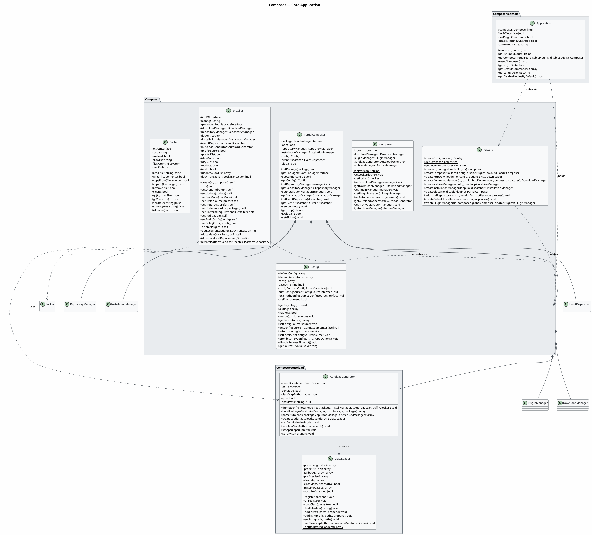
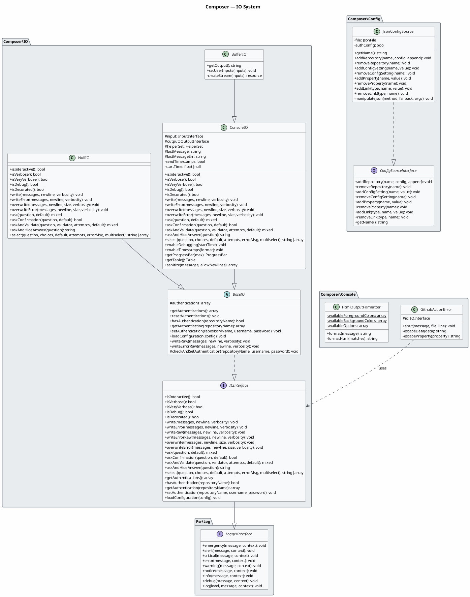

Looking at the IR for Composer (a large PHP dependency manager with 309 classes), I'll produce 8 focused class diagrams covering its major subsystems.

```plantuml
@startuml composer-01-package-model
skinparam classAttributeIconSize 0
skinparam shadowing false
skinparam defaultFontName "Segoe UI"
skinparam defaultFontSize 11
skinparam backgroundColor #FEFEFE
skinparam class {
    BackgroundColor #F8F9FA
    BorderColor #495057
    ArrowColor #495057
    FontColor #212529
}
skinparam interface {
    BackgroundColor #D4EDDA
    BorderColor #28A745
    FontColor #155724
}
skinparam package {
    BackgroundColor #E9ECEF
    BorderColor #6C757D
}

title Composer — Package Model

package "Composer\\Package" {

    interface PackageInterface {
        +getName(): string
        +getVersion(): string
        +getPrettyVersion(): string
        +getRequires(): Link[]
        +getConflicts(): Link[]
        +getProvides(): Link[]
        +getReplaces(): Link[]
        +getDevRequires(): Link[]
        +getAutoload(): array
        +isDev(): bool
        +getType(): string
        +getExtra(): array
        +getRepository(): RepositoryInterface
        +setInstallationSource(type): void
        +getInstallationSource(): string
        +getSourceUrls(): array
        +getDistUrls(): array
    }

    interface CompletePackageInterface {
        +getScripts(): array
        +getLicense(): array
        +getAuthors(): array
        +getDescription(): string
        +getKeywords(): array
        +getHomepage(): string
        +isAbandoned(): bool
        +getReplacementPackage(): string
        +getArchiveName(): string
        +getArchiveExcludes(): array
    }

    interface RootPackageInterface {
        +getAliases(): array
        +getMinimumStability(): string
        +getStabilityFlags(): array
        +getPreferStable(): bool
        +getConfig(): array
        +getReferences(): array
        +setRequires(requires): void
        +setDevRequires(devRequires): void
        +setStabilityFlags(flags): void
        +setMinimumStability(minimumStability): void
        +setPreferStable(preferStable): void
        +setConfig(config): void
    }

    abstract class BasePackage {
        +id: int
        #name: string
        #prettyName: string
        #repository: RepositoryInterface
        +{static} supportedLinkTypes: array
        +{static} stabilities: array
        +getName(): string
        +getPrettyName(): string
        +setRepository(repo): void
        +getRepository(): RepositoryInterface
        +getId(): int
        +setId(id): void
        +equals(package): bool
        +getStabilityPriority(): int
        +{static} packageNameToRegexp(allowPattern, wrap): string
    }

    class Package {
        #type: string
        #version: string
        #prettyVersion: string
        #dev: bool
        #stability: string
        #requires: Link[]
        #conflicts: Link[]
        #provides: Link[]
        #replaces: Link[]
        #devRequires: Link[]
        #autoload: array
        #devAutoload: array
        #suggests: array
        #sourceType: string
        #distType: string
        +getVersion(): string
        +getStability(): string
        +getRequires(): Link[]
        +setRequires(requires): void
        +getAutoload(): array
        +setAutoload(autoload): void
        +replaceVersion(version, prettyVersion): void
    }

    class CompletePackage {
        #license: array
        #keywords: array
        #authors: array
        #description: string
        #homepage: string
        #scripts: array
        #funding: array
        #support: array
        #abandoned: bool
        #archiveName: string
        #archiveExcludes: array
        +getLicense(): array
        +getAuthors(): array
        +getDescription(): string
        +isAbandoned(): bool
        +setAbandoned(abandoned): void
        +getScripts(): array
    }

    class RootPackage {
        #minimumStability: string
        #preferStable: bool
        #stabilityFlags: array
        #config: array
        #references: array
        #aliases: array
        +getMinimumStability(): string
        +getAliases(): array
        +getStabilityFlags(): array
        +getPreferStable(): bool
        +getReferences(): array
    }

    class AliasPackage {
        #version: string
        #prettyVersion: string
        #stability: string
        #dev: bool
        #aliasOf: Package
        #requires: Link[]
        #devRequires: Link[]
        #conflicts: Link[]
        #provides: Link[]
        #replaces: Link[]
        +getAliasOf(): Package
        +isRootPackageAlias(): bool
        +setRootPackageAlias(value): void
    }

    class CompleteAliasPackage {
        #aliasOf: CompletePackage
        +getAliasOf(): CompletePackage
    }

    class RootAliasPackage {
        #aliasOf: RootPackage
        +getAliasOf(): RootPackage
        +__clone(): void
    }

    class Link {
        +{static} TYPES: array
        #source: string
        #target: string
        #constraint: ConstraintInterface
        #description: string
        #prettyConstraint: string
        +getSource(): string
        +getTarget(): string
        +getConstraint(): ConstraintInterface
        +getDescription(): string
        +getPrettyConstraint(): string
        +__toString(): string
    }

    class Locker {
        -lockFile: JsonFile
        -installationManager: InstallationManager
        -hash: string
        -contentHash: string
        -loader: ArrayLoader
        -dumper: ArrayDumper
        +isLocked(): bool
        +isFresh(): bool
        +getLockedRepository(withDevReqs): LockArrayRepository
        +setLockData(packages, devPackages, ...): bool
        +getPlatformRequirements(withDevReqs): array
        +getMinimumStability(): string
        +getAliases(): array
        +getPluginApi(): string
        +{static} getContentHash(composerFileContents): string
    }

}

package "Composer\\Package\\Loader" {
    interface LoaderInterface {
        +load(config, class): PackageInterface
    }

    class ArrayLoader {
        #versionParser: VersionParser
        #loadOptions: bool
        +load(config, class): PackageInterface
        +parseLinks(source, sourceVersion, desc, links): Link[]
        +getBranchAlias(config): array
    }

    class RootPackageLoader {
        -manager: RepositoryManager
        -config: Config
        -versionGuesser: VersionGuesser
        -io: IOInterface
        +load(config, class, cwd): RootPackageInterface
        +{static} extractStabilityFlags(requires, minStab, flags): array
        +{static} extractReferences(requires, references): array
    }

    class ValidatingArrayLoader {
        -loader: LoaderInterface
        -versionParser: VersionParser
        -errors: array
        -warnings: array
        +load(config, class): PackageInterface
        +getWarnings(): array
        +getErrors(): array
        +{static} hasPackageNamingError(name, isLink): bool
    }

    class JsonLoader {
        -loader: LoaderInterface
        +load(json): PackageInterface
    }
}

CompletePackageInterface --|> PackageInterface
RootPackageInterface --|> CompletePackageInterface
BasePackage ..|> PackageInterface
Package --|> BasePackage
CompletePackage --|> Package
CompletePackage ..|> CompletePackageInterface
RootPackage --|> CompletePackage
RootPackage ..|> RootPackageInterface
AliasPackage --|> BasePackage
CompleteAliasPackage --|> AliasPackage
CompleteAliasPackage ..|> CompletePackageInterface
RootAliasPackage --|> CompleteAliasPackage
RootAliasPackage ..|> RootPackageInterface

Package o-- Link : requires/conflicts/replaces/provides

ArrayLoader ..|> LoaderInterface
RootPackageLoader --|> ArrayLoader
ValidatingArrayLoader ..|> LoaderInterface

@enduml
```

```plantuml
@startuml composer-02-repository-architecture
skinparam classAttributeIconSize 0
skinparam shadowing false
skinparam defaultFontName "Segoe UI"
skinparam defaultFontSize 11
skinparam backgroundColor #FEFEFE
skinparam class {
    BackgroundColor #F8F9FA
    BorderColor #495057
    ArrowColor #495057
    FontColor #212529
}
skinparam interface {
    BackgroundColor #D4EDDA
    BorderColor #28A745
    FontColor #155724
}
skinparam package {
    BackgroundColor #E9ECEF
    BorderColor #6C757D
}

title Composer — Repository Architecture

package "Composer\\Repository" {

    interface RepositoryInterface {
        +hasPackage(package): bool
        +findPackage(name, constraint): PackageInterface
        +findPackages(name, constraint): array
        +getPackages(): array
        +loadPackages(nameMap, stabilities, flags, loaded): array
        +search(query, mode, type): array
        +getProviders(packageName): array
        +getRepoName(): string
    }

    interface WritableRepositoryInterface {
        +write(devMode, installManager): void
        +addPackage(package): void
        +removePackage(package): void
        +getCanonicalPackages(): array
        +reload(): void
        +setDevPackageNames(names): void
        +getDevPackageNames(): array
    }

    interface InstalledRepositoryInterface {
        +getDevMode(): bool
        +isFresh(): bool
    }

    interface ConfigurableRepositoryInterface {
        +getRepoConfig(): array
    }

    interface AdvisoryProviderInterface {
        +hasSecurityAdvisories(): bool
        +getSecurityAdvisories(constraints, allowPartial): array
    }

    interface FilterListProviderInterface {
        +hasFilter(): bool
        +getFilter(packageConstraintMap, configuredLists): array
        +getFilterLists(): array
    }

    class ArrayRepository {
        #packages: array
        #packageMap: array
        +getRepoName(): string
        +findPackage(name, constraint): PackageInterface
        +findPackages(name, constraint): array
        +addPackage(package): void
        +removePackage(package): void
        +getPackages(): array
        +count(): int
        #initialize(): void
        +getProviders(packageName): array
        #createAliasPackage(package, alias, prettyAlias): AliasPackage
    }

    class WritableArrayRepository {
        #devPackageNames: array
        +write(devMode, installManager): void
        +reload(): void
        +getDevMode(): bool
        +setDevPackageNames(names): void
        +getDevPackageNames(): array
    }

    class FilesystemRepository {
        #file: JsonFile
        -dumpVersions: bool
        -rootPackage: RootPackageInterface
        -filesystem: Filesystem
        +write(devMode, installManager): void
        +reload(): void
        +{static} safelyLoadInstalledVersions(path): array
        -generateInstalledVersions(installManager, installPaths, devMode, repoDir): array
    }

    class InstalledArrayRepository {
        +getRepoName(): string
        +isFresh(): bool
    }

    class InstalledFilesystemRepository {
        +getRepoName(): string
        +isFresh(): bool
    }

    class CompositeRepository {
        -repositories: RepositoryInterface[]
        +getRepoName(): string
        +getRepositories(): array
        +hasPackage(package): bool
        +findPackage(name, constraint): PackageInterface
        +findPackages(name, constraint): array
        +addRepository(repo): void
        +count(): int
    }

    class InstalledRepository {
        +findPackagesWithReplacersAndProviders(name, constraint): array
        +getDependents(needle, constraint, invert, recurse, packagesFound): array
        +getRepoName(): string
        +addRepository(repo): void
    }

    class ComposerRepository {
        -url: string
        -baseUrl: string
        -io: IOInterface
        -httpDownloader: HttpDownloader
        -hasProviders: bool
        -lazyProvidersUrl: string
        -hasAvailablePackageList: bool
        +getRepoName(): string
        +getRepoConfig(): array
        +loadPackages(nameMap, stabilities, flags, loaded): array
        +hasSecurityAdvisories(): bool
        +getSecurityAdvisories(constraints, partial): array
        +hasFilter(): bool
        +getFilter(packageConstraintMap, configuredLists): array
        +search(query, mode, type): array
    }

    class VcsRepository {
        #url: string
        #type: string
        #loader: LoaderInterface
        #httpDownloader: HttpDownloader
        #branchErrorOccurred: bool
        +getRepoName(): string
        +getRepoConfig(): array
        +getDriver(): VcsDriverInterface
        +hadInvalidBranches(): bool
        +getEmptyReferences(): array
        #initialize(): void
    }

    class PlatformRepository {
        -versionParser: VersionParser
        -overrides: array
        -disabledPackages: array
        +getRepoName(): string
        +{static} isPlatformPackage(name): bool
        +{static} getPlatformPhpVersion(): string
        +isPlatformPackageDisabled(name): bool
        +getDisabledPackages(): array
        #initialize(): void
    }

    class PathRepository {
        -url: string
        -options: array
        -versionGuesser: VersionGuesser
        +getRepoName(): string
        +getRepoConfig(): array
        #initialize(): void
    }

    class ArtifactRepository {
        #loader: ArrayLoader
        #lookup: string
        +getRepoName(): string
        +getRepoConfig(): array
        #initialize(): void
    }

    class LockArrayRepository {
        +getRepoName(): string
    }

    class PackageRepository {
        -config: array
        +getRepoName(): string
        +hasSecurityAdvisories(): bool
        +getSecurityAdvisories(constraints, partial): array
        +hasFilter(): bool
        +getFilter(packageConstraintMap, configuredLists): array
    }

    class FilterRepository {
        -only: array|null
        -exclude: array|null
        -canonical: bool
        -repo: RepositoryInterface
        +getRepoName(): string
        +getRepository(): RepositoryInterface
        +hasSecurityAdvisories(): bool
        +getSecurityAdvisories(constraints, partial): array
        +hasFilter(): bool
        +getFilter(packageConstraintMap, configuredLists): array
        -isAllowed(name): bool
    }

    class RootPackageRepository {
        +getRepoName(): string
    }

    class RepositoryManager {
        -localRepository: InstalledRepositoryInterface
        -repositories: RepositoryInterface[]
        -repositoryClasses: array
        -io: IOInterface
        -config: Config
        -httpDownloader: HttpDownloader
        +findPackage(name, constraint): PackageInterface
        +addRepository(repo): void
        +prependRepository(repo): void
        +createRepository(type, config, name): RepositoryInterface
        +setRepositoryClass(type, class): void
        +getRepositories(): array
        +setLocalRepository(repo): void
        +getLocalRepository(): InstalledRepositoryInterface
    }

    class RepositorySet {
        -repositories: RepositoryInterface[]
        -acceptableStabilities: array
        -stabilityFlags: array
        -rootRequires: array
        -rootAliases: array
        -rootReferences: array
        +addRepository(repo): void
        +findPackages(name, constraint, flags): array
        +getSecurityAdvisories(packageNames, allowPartial, ignoreUnreachable): array
        +createPool(request, io, eventDispatcher, poolOptimizer, ...): Pool
        +isPackageAcceptable(names, stability): bool
        +getProviders(packageName): array
    }

}

WritableRepositoryInterface --|> RepositoryInterface
InstalledRepositoryInterface --|> WritableRepositoryInterface
ArrayRepository ..|> RepositoryInterface
WritableArrayRepository --|> ArrayRepository
WritableArrayRepository ..|> WritableRepositoryInterface
FilesystemRepository --|> WritableArrayRepository
InstalledArrayRepository --|> WritableArrayRepository
InstalledArrayRepository ..|> InstalledRepositoryInterface
InstalledFilesystemRepository --|> FilesystemRepository
InstalledFilesystemRepository ..|> InstalledRepositoryInterface
CompositeRepository ..|> RepositoryInterface
InstalledRepository --|> CompositeRepository
ComposerRepository --|> ArrayRepository
ComposerRepository ..|> ConfigurableRepositoryInterface
ComposerRepository ..|> AdvisoryProviderInterface
ComposerRepository ..|> FilterListProviderInterface
VcsRepository --|> ArrayRepository
VcsRepository ..|> ConfigurableRepositoryInterface
PlatformRepository --|> ArrayRepository
PathRepository --|> ArrayRepository
PathRepository ..|> ConfigurableRepositoryInterface
ArtifactRepository --|> ArrayRepository
ArtifactRepository ..|> ConfigurableRepositoryInterface
LockArrayRepository --|> ArrayRepository
PackageRepository --|> ArrayRepository
PackageRepository ..|> AdvisoryProviderInterface
PackageRepository ..|> FilterListProviderInterface
FilterRepository ..|> RepositoryInterface
FilterRepository ..|> AdvisoryProviderInterface
FilterRepository ..|> FilterListProviderInterface
RootPackageRepository --|> ArrayRepository

RepositoryManager o-- RepositoryInterface : manages

@enduml
```

```plantuml
@startuml composer-03-downloader-architecture
skinparam classAttributeIconSize 0
skinparam shadowing false
skinparam defaultFontName "Segoe UI"
skinparam defaultFontSize 11
skinparam backgroundColor #FEFEFE
skinparam class {
    BackgroundColor #F8F9FA
    BorderColor #495057
    ArrowColor #495057
    FontColor #212529
}
skinparam interface {
    BackgroundColor #D4EDDA
    BorderColor #28A745
    FontColor #155724
}
skinparam package {
    BackgroundColor #E9ECEF
    BorderColor #6C757D
}

title Composer — Downloader Architecture

package "Composer\\Downloader" {

    interface DownloaderInterface {
        +getInstallationSource(): string
        +download(package, path, prevPackage): PromiseInterface
        +prepare(type, package, path, prevPackage): PromiseInterface
        +install(package, path): PromiseInterface
        +update(initial, target, path): PromiseInterface
        +remove(package, path): PromiseInterface
        +cleanup(type, package, path, prevPackage): PromiseInterface
    }

    interface ChangeReportInterface {
        +getLocalChanges(package, path): string|null
    }

    interface VcsCapableDownloaderInterface {
        +getVcsReference(package, path): string|null
    }

    interface DvcsDownloaderInterface {
        +getUnpushedChanges(package, path): string|null
    }

    class FileDownloader {
        #io: IOInterface
        #config: Config
        #httpDownloader: HttpDownloader
        #filesystem: Filesystem
        #cache: Cache
        #eventDispatcher: EventDispatcher
        +{static} downloadMetadata: array
        +{static} responseHeaders: array
        -lastCacheWrites: array
        -additionalCleanupPaths: array
        +getInstallationSource(): string
        +download(package, path, prevPackage, output): PromiseInterface
        +prepare(type, package, path, prevPackage): PromiseInterface
        +cleanup(type, package, path, prevPackage): PromiseInterface
        +install(package, path, output): PromiseInterface
        +update(initial, target, path): PromiseInterface
        +remove(package, path, output): PromiseInterface
        +getLocalChanges(package, path): string|null
        #processUrl(package, url): string
        #getFileName(package, path): string
    }

    abstract class ArchiveDownloader {
        #cleanupExecuted: array
        +prepare(type, package, path, prevPackage): PromiseInterface
        +cleanup(type, package, path, prevPackage): PromiseInterface
        +install(package, path, output): PromiseInterface
        #{abstract} extract(package, file, path): PromiseInterface
        #getInstallOperationAppendix(package, path): string
    }

    abstract class VcsDownloader {
        #io: IOInterface
        #config: Config
        #process: ProcessExecutor
        #filesystem: Filesystem
        #hasCleanedChanges: array
        +getInstallationSource(): string
        +download(package, path, prevPackage): PromiseInterface
        +prepare(type, package, path, prevPackage): PromiseInterface
        +cleanup(type, package, path, prevPackage): PromiseInterface
        +install(package, path): PromiseInterface
        +update(initial, target, path): PromiseInterface
        +remove(package, path): PromiseInterface
        +getVcsReference(package, path): string|null
        #{abstract} doDownload(package, path, url, prevPackage): void
        #{abstract} doInstall(package, path, url): void
        #{abstract} doUpdate(initial, target, path, url): void
        #{abstract} getCommitLogs(fromRef, toRef, path): string
        #{abstract} hasMetadataRepository(path): bool
        #cleanChanges(package, path, update): void
        #reapplyChanges(path): void
    }

    class PathDownloader {
        +download(package, path, prevPackage, output): PromiseInterface
        +install(package, path, output): PromiseInterface
        +remove(package, path, output): PromiseInterface
        +getVcsReference(package, path): string|null
        #getInstallOperationAppendix(package, path): string
    }

    class GitDownloader {
        -hasStashedChanges: array
        -hasDiscardedChanges: array
        -gitUtil: Git
        -cachedPackages: array
        +doDownload(package, path, url, prevPackage): void
        +doInstall(package, path, url): void
        +doUpdate(initial, target, path, url): void
        +getLocalChanges(package, path): string|null
        +getUnpushedChanges(package, path): string|null
        #cleanChanges(package, path, update): void
        #updateToCommit(package, path, reference, prettyVersion): void
    }

    class SvnDownloader {
        #cacheCredentials: bool
        +doDownload(package, path, url, prevPackage): void
        +doInstall(package, path, url): void
        +doUpdate(initial, target, path, url): void
        +getLocalChanges(package, path): string|null
    }

    class HgDownloader {
        +doDownload(package, path, url, prevPackage): void
        +doInstall(package, path, url): void
        +doUpdate(initial, target, path, url): void
        +getLocalChanges(package, path): string|null
    }

    class FossilDownloader {
        +doDownload(package, path, url, prevPackage): void
        +doInstall(package, path, url): void
        +doUpdate(initial, target, path, url): void
        +getLocalChanges(package, path): string|null
    }

    class PerforceDownloader {
        #perforce: Perforce
        +doDownload(package, path, url, prevPackage): void
        +doInstall(package, path, url): void
        +doUpdate(initial, target, path, url): void
        +getLocalChanges(package, path): string|null
    }

    class ZipDownloader {
        -zipArchiveObject: ZipArchive|null
        +download(package, path, prevPackage, output): PromiseInterface
        #extract(package, file, path): PromiseInterface
    }

    class TarDownloader {
        #extract(package, file, path): PromiseInterface
    }

    class GzipDownloader {
        #extract(package, file, path): PromiseInterface
    }

    class PharDownloader {
        #extract(package, file, path): PromiseInterface
    }

    class RarDownloader {
        #extract(package, file, path): PromiseInterface
    }

    class XzDownloader {
        #extract(package, file, path): PromiseInterface
    }

    class DownloadManager {
        -io: IOInterface
        -preferDist: bool
        -preferSource: bool
        -packagePreferences: array
        -filesystem: Filesystem
        -downloaders: array
        -sourceFallback: bool
        +setPreferSource(prefer): self
        +setPreferDist(prefer): self
        +setPreferences(preferences): self
        +setSourceFallback(fallback): self
        +setDownloader(type, downloader): void
        +getDownloader(type): DownloaderInterface
        +getDownloaderForPackage(package): DownloaderInterface
        +download(package, targetDir, prevPackage): PromiseInterface
        +prepare(type, package, targetDir, prevPackage): PromiseInterface
        +install(package, targetDir): PromiseInterface
        +update(initial, target, targetDir): PromiseInterface
        +remove(package, targetDir): PromiseInterface
        +cleanup(type, package, targetDir, prevPackage): PromiseInterface
        #resolvePackageInstallPreference(package): string
    }

}

FileDownloader ..|> DownloaderInterface
FileDownloader ..|> ChangeReportInterface
ArchiveDownloader --|> FileDownloader
VcsDownloader ..|> DownloaderInterface
VcsDownloader ..|> ChangeReportInterface
VcsDownloader ..|> VcsCapableDownloaderInterface
Path
```plantuml
@startuml composer-03-downloader-architecture
skinparam classAttributeIconSize 0
skinparam shadowing false
skinparam defaultFontName "Segoe UI"
skinparam defaultFontSize 11
skinparam backgroundColor #FEFEFE
skinparam class {
    BackgroundColor #F8F9FA
    BorderColor #495057
    ArrowColor #495057
    FontColor #212529
}
skinparam interface {
    BackgroundColor #D4EDDA
    BorderColor #28A745
    FontColor #155724
}
skinparam package {
    BackgroundColor #E9ECEF
    BorderColor #6C757D
}

title Composer — Downloader Architecture

package "Composer\\Downloader" {

    interface DownloaderInterface {
        +getInstallationSource(): string
        +download(package, path, prevPackage): PromiseInterface
        +prepare(type, package, path, prevPackage): PromiseInterface
        +install(package, path): PromiseInterface
        +update(initial, target, path): PromiseInterface
        +remove(package, path): PromiseInterface
        +cleanup(type, package, path, prevPackage): PromiseInterface
    }

    interface ChangeReportInterface {
        +getLocalChanges(package, path): string|null
    }

    interface VcsCapableDownloaderInterface {
        +getVcsReference(package, path): string|null
    }

    interface DvcsDownloaderInterface {
        +getUnpushedChanges(package, path): string|null
    }

    class FileDownloader {
        #io: IOInterface
        #config: Config
        #httpDownloader: HttpDownloader
        #filesystem: Filesystem
        #cache: Cache
        #eventDispatcher: EventDispatcher
        +getInstallationSource(): string
        +download(package, path, prevPackage, output): PromiseInterface
        +install(package, path, output): PromiseInterface
        +update(initial, target, path): PromiseInterface
        +remove(package, path, output): PromiseInterface
        +getLocalChanges(package, path): string|null
        #getFileName(package, path): string
        #processUrl(package, url): string
    }

    abstract class ArchiveDownloader {
        +install(package, path, output): PromiseInterface
        #{abstract} extract(package, file, path): PromiseInterface
    }

    abstract class VcsDownloader {
        #io: IOInterface
        #config: Config
        #process: ProcessExecutor
        #filesystem: Filesystem
        +getInstallationSource(): string
        +download(package, path, prevPackage): PromiseInterface
        +install(package, path): PromiseInterface
        +update(initial, target, path): PromiseInterface
        +remove(package, path): PromiseInterface
        +getVcsReference(package, path): string|null
        #{abstract} doDownload(package, path, url, prev): void
        #{abstract} doInstall(package, path, url): void
        #{abstract} doUpdate(initial, target, path, url): void
        #{abstract} getCommitLogs(fromRef, toRef, path): string
        #{abstract} hasMetadataRepository(path): bool
        #cleanChanges(package, path, update): void
        #reapplyChanges(path): void
    }

    class PathDownloader {
        +download(package, path, prev, output): PromiseInterface
        +install(package, path, output): PromiseInterface
        +remove(package, path, output): PromiseInterface
        +getVcsReference(package, path): string|null
    }

    class GitDownloader {
        -gitUtil: Git
        +doDownload(package, path, url, prev): void
        +doInstall(package, path, url): void
        +doUpdate(initial, target, path, url): void
        +getLocalChanges(package, path): string|null
        +getUnpushedChanges(package, path): string|null
        #cleanChanges(package, path, update): void
        #updateToCommit(package, path, ref, prettyVersion): void
    }

    class SvnDownloader {
        #cacheCredentials: bool
        +doDownload(package, path, url, prev): void
        +doInstall(package, path, url): void
        +doUpdate(initial, target, path, url): void
        +getLocalChanges(package, path): string|null
    }

    class HgDownloader {
        +doDownload(package, path, url, prev): void
        +doInstall(package, path, url): void
        +doUpdate(initial, target, path, url): void
        +getLocalChanges(package, path): string|null
    }

    class FossilDownloader {
        +doDownload(package, path, url, prev): void
        +doInstall(package, path, url): void
        +doUpdate(initial, target, path, url): void
        +getLocalChanges(package, path): string|null
    }

    class PerforceDownloader {
        #perforce: Perforce
        +doDownload(package, path, url, prev): void
        +doInstall(package, path, url): void
        +doUpdate(initial, target, path, url): void
        +getLocalChanges(package, path): string|null
    }

    class ZipDownloader {
        #extract(package, file, path): PromiseInterface
    }

    class TarDownloader {
        #extract(package, file, path): PromiseInterface
    }

    class GzipDownloader {
        #extract(package, file, path): PromiseInterface
    }

    class PharDownloader {
        #extract(package, file, path): PromiseInterface
    }

    class RarDownloader {
        #extract(package, file, path): PromiseInterface
    }

    class XzDownloader {
        #extract(package, file, path): PromiseInterface
    }

    class DownloadManager {
        -io: IOInterface
        -preferDist: bool
        -preferSource: bool
        -downloaders: array
        -sourceFallback: bool
        +setDownloader(type, downloader): void
        +getDownloader(type): DownloaderInterface
        +getDownloaderForPackage(package): DownloaderInterface
        +download(package, targetDir, prevPackage): PromiseInterface
        +install(package, targetDir): PromiseInterface
        +update(initial, target, targetDir): PromiseInterface
        +remove(package, targetDir): PromiseInterface
        #resolvePackageInstallPreference(package): string
    }

}

FileDownloader ..|> DownloaderInterface
FileDownloader ..|> ChangeReportInterface
ArchiveDownloader --|> FileDownloader
VcsDownloader ..|> DownloaderInterface
VcsDownloader ..|> ChangeReportInterface
VcsDownloader ..|> VcsCapableDownloaderInterface
PathDownloader --|> FileDownloader
PathDownloader ..|> VcsCapableDownloaderInterface
GitDownloader --|> VcsDownloader
GitDownloader ..|> DvcsDownloaderInterface
SvnDownloader --|> VcsDownloader
HgDownloader --|> VcsDownloader
FossilDownloader --|> VcsDownloader
PerforceDownloader --|> VcsDownloader
ZipDownloader --|> ArchiveDownloader
TarDownloader --|> ArchiveDownloader
GzipDownloader --|> ArchiveDownloader
PharDownloader --|> ArchiveDownloader
RarDownloader --|> ArchiveDownloader
XzDownloader --|> ArchiveDownloader
DownloadManager o-- DownloaderInterface : manages

@enduml
```

```plantuml
@startuml composer-04-command-architecture
skinparam classAttributeIconSize 0
skinparam shadowing false
skinparam defaultFontName "Segoe UI"
skinparam defaultFontSize 11
skinparam backgroundColor #FEFEFE
skinparam class {
    BackgroundColor #F8F9FA
    BorderColor #495057
    ArrowColor #495057
    FontColor #212529
}
skinparam package {
    BackgroundColor #E9ECEF
    BorderColor #6C757D
}

title Composer — Command Architecture

package "Symfony\\Console" {
    class Command {
        +configure(): void
        +execute(input, output): int
        +run(input, output): int
        +interact(input, output): void
    }
}

package "Composer\\Command" {

    class BaseCommand {
        -composer: Composer|null
        -io: IOInterface|null
        +getComposer(required, disablePlugins): Composer
        +requireComposer(disablePlugins): Composer
        +tryComposer(disablePlugins): Composer|null
        +setComposer(composer): void
        +resetComposer(): void
        +getIO(): IOInterface
        +setIO(io): void
        +isProxyCommand(): bool
        +complete(input, suggestions): void
        #getPlatformRequirementFilter(input): PlatformRequirementFilterInterface
        #getAuditFormat(input, optName): string
        #createPolicyConfig(config, input): PolicyConfig
        #createAuditConfig(input): AuditConfig
        #getPreferredInstallOptions(config, input): array
        #formatRequirements(requirements): array
    }

    class BaseConfigCommand {
        #config: Config
        #configFile: JsonFile
        #configSource: ConfigSourceInterface
        +initialize(input, output): void
        #getComposerConfigFile(input, config): JsonFile
        #getAuthConfigFile(input, config): JsonFile
    }

    class BaseDependencyCommand {
        #colors: array
        #doExecute(input, output, inverted): int
        #printTable(output, results): void
        #initStyles(output): void
        #printTree(results, prefix, level): void
    }

    class ConfigCommand {
        #authConfigFile: JsonFile
        #authConfigSource: ConfigSourceInterface
        +execute(input, output): int
        #handleSingleValue(key, callbacks, values, method): void
        #handleMultiValue(key, callbacks, values, method): void
        #listConfiguration(contents, rawContents, output, k, showSource): void
    }

    class PolicyCommand {
        +execute(input, output): int
        -assertCustomListName(name): void
        -validateSourceConfig(listName, source): void
    }

    class RepositoryCommand {
        +execute(input, output): int
        -listRepositories(repos): void
    }

    class DependsCommand {
        +configure(): void
        +execute(input, output): int
    }

    class ProhibitsCommand {
        +configure(): void
        +execute(input, output): int
    }

    class RequireCommand {
        -newlyCreated: bool
        -json: JsonFile
        -file: string
        -composerBackup: string
        -lock: string
        -lockBackup: string
        +execute(input, output): int
        -doUpdate(input, output, io, requirements, requireKey, removeKey): int
        -updateFileCleanly(json, new, requireKey, removeKey, sortPackages): bool
        -revertComposerFile(): void
    }

    class UpdateCommand {
        +execute(input, output): int
        -getPackagesInteractively(io, input, output, composer, packages): array
        -createVersionSelector(composer): VersionSelector
    }

    class InstallCommand {
        +execute(input, output): int
    }

    class CreateProjectCommand {
        #suggestedPackagesReporter: SuggestedPackagesReporter
        +execute(input, output): int
        +installProject(io, config, input, packageName, ...): void
    }

    class ShowCommand {
        #versionParser: VersionParser
        #colors: array
        +execute(input, output): int
        #printPackageInfo(package, versions, installedRepo, latest): void
        #printMeta(package, versions, installedRepo, latest): void
        #printLinks(package, linkType, title): void
        #generatePackageTree(package, installedRepo, remoteRepos): array
    }

    class AuditCommand {
        +execute(input, output): int
        -getPackages(composer, input): array
    }

    class SearchCommand {
        +execute(input, output): int
    }

    class InitCommand {
        -gitConfig: array|null
        +execute(input, output): int
        +namespaceFromPackageName(name): string
        +interact(input, output): void
        #formatAuthors(author): array
    }

    class GlobalCommand {
        +run(input, output): int
        +complete(input, suggestions): void
        +isProxyCommand(): bool
    }

    class SelfUpdateCommand {
        +execute(input, output): int
        #fetchKeys(io, config): void
        #rollback(output, rollbackDir, localFilename): void
        #setLocalPhar(localFilename, newFilename, backupTarget): void
    }

    class RunScriptCommand {
        #scriptEvents: array
        +execute(input, output): int
        #listScripts(output): void
    }

    class BumpCommand {
        +execute(input, output): int
        +doBump(io, devOnly, noDevOnly, dryRun, packagesFilter, hint): int
    }

    class DiagnoseCommand {
        #httpDownloader: HttpDownloader
        #process: ProcessExecutor
        #exitCode: int
        +execute(input, output): int
        -checkGit(): string
        -checkHttp(proto, config): string
        -checkVersion(config): string
        -checkComposerAudit(config): string
    }

    class ScriptAliasCommand {
        -script: string
        -description: string
        -aliases: array
        +execute(input, output): int
    }

    note as NoteOtherCmds
      Also extends BaseCommand:
      AboutCommand, ArchiveCommand,
      CheckPlatformReqsCommand,
      ClearCacheCommand, DumpAutoloadCommand,
      ExecCommand, FundCommand, HomeCommand,
      LicensesCommand, OutdatedCommand,
      ReinstallCommand, RemoveCommand,
      StatusCommand, SuggestsCommand,
      ValidateCommand
    end note

}

BaseCommand --|> Command
BaseConfigCommand --|> BaseCommand
BaseDependencyCommand --|> BaseCommand
ConfigCommand --|> BaseConfigCommand
PolicyCommand --|> BaseConfigCommand
RepositoryCommand --|> BaseConfigCommand
DependsCommand --|> BaseDependencyCommand
ProhibitsCommand --|> BaseDependencyCommand
RequireCommand --|> BaseCommand
UpdateCommand --|> BaseCommand
InstallCommand --|> BaseCommand
CreateProjectCommand --|> BaseCommand
ShowCommand --|> BaseCommand
AuditCommand --|> BaseCommand
SearchCommand --|> BaseCommand
InitCommand --|> BaseCommand
GlobalCommand --|> BaseCommand
SelfUpdateCommand --|> BaseCommand
RunScriptCommand --|> BaseCommand
BumpCommand --|> BaseCommand
DiagnoseCommand --|> BaseCommand
ScriptAliasCommand --|> BaseCommand

@enduml
```

```plantuml
@startuml composer-05-core-application
skinparam classAttributeIconSize 0
skinparam shadowing false
skinparam defaultFontName "Segoe UI"
skinparam defaultFontSize 11
skinparam backgroundColor #FEFEFE
skinparam class {
    BackgroundColor #F8F9FA
    BorderColor #495057
    ArrowColor #495057
    FontColor #212529
}
skinparam package {
    BackgroundColor #E9ECEF
    BorderColor #6C757D
}

title Composer — Core Application

package "Composer" {

    class PartialComposer {
        -package: RootPackageInterface
        -loop: Loop
        -repositoryManager: RepositoryManager
        -installationManager: InstallationManager
        -config: Config
        -eventDispatcher: EventDispatcher
        -global: bool
        +setPackage(package): void
        +getPackage(): RootPackageInterface
        +setConfig(config): void
        +getConfig(): Config
        +setRepositoryManager(manager): void
        +getRepositoryManager(): RepositoryManager
        +setInstallationManager(manager): void
        +getInstallationManager(): InstallationManager
        +setEventDispatcher(dispatcher): void
        +getEventDispatcher(): EventDispatcher
        +setLoop(loop): void
        +getLoop(): Loop
        +isGlobal(): bool
        +setGlobal(): void
    }

    class Composer {
        -locker: Locker|null
        -downloadManager: DownloadManager
        -pluginManager: PluginManager
        -autoloadGenerator: AutoloadGenerator
        -archiveManager: ArchiveManager
        +{static} getVersion(): string
        +setLocker(locker): void
        +getLocker(): Locker
        +setDownloadManager(manager): void
        +getDownloadManager(): DownloadManager
        +setPluginManager(manager): void
        +getPluginManager(): PluginManager
        +setAutoloadGenerator(generator): void
        +getAutoloadGenerator(): AutoloadGenerator
        +setArchiveManager(manager): void
        +getArchiveManager(): ArchiveManager
    }

    class Factory {
        +{static} createConfig(io, cwd): Config
        +{static} getComposerFile(): string
        +{static} getLockFile(composerFile): string
        +{static} create(io, config, disablePlugins): Composer
        +createComposer(io, localConfig, disablePlugins, cwd, fullLoad): Composer
        +{static} createHttpDownloader(io, config, options): HttpDownloader
        +createDownloadManager(io, config, httpDownloader, process, dispatcher): DownloadManager
        +createArchiveManager(config, dm, loop): ArchiveManager
        +createInstallationManager(loop, io, dispatcher): InstallationManager
        +{static} createGlobal(io, disablePlugins): PartialComposer
        #addLocalRepository(io, rm, vendorDir, rootPackage, process): void
        #createDefaultInstallers(im, composer, io, process): void
        #createPluginManager(io, composer, globalComposer, disablePlugins): PluginManager
    }

    class Installer {
        #io: IOInterface
        #config: Config
        #package: RootPackageInterface
        #downloadManager: DownloadManager
        #repositoryManager: RepositoryManager
        #locker: Locker
        #installationManager: InstallationManager
        #eventDispatcher: EventDispatcher
        #autoloadGenerator: AutoloadGenerator
        #preferSource: bool
        #preferDist: bool
        #devMode: bool
        #dryRun: bool
        #update: bool
        #audit: bool
        #updateAllowList: array
        #lockTransaction: LockTransaction|null
        +{static} create(io, composer): self
        +run(): int
        +setDryRun(dryRun): self
        +setUpdate(update): self
        +setDevMode(devMode): self
        +setPreferSource(prefer): self
        +setPreferDist(prefer): self
        +setUpdateAllowList(packages): self
        +setPlatformRequirementFilter(filter): self
        +setAudit(audit): self
        +setAuditConfig(config): self
        +setPolicyConfig(config): self
        +disablePlugins(): self
        +getLockTransaction(): LockTransaction|null
        #doUpdate(localRepo, doInstall): int
        #doInstall(localRepo, alreadySolved): int
        #createPlatformRepo(forUpdate): PlatformRepository
    }

    class Config {
        +{static} defaultConfig: array
        +{static} defaultRepositories: array
        -config: array
        -baseDir: string|null
        -configSource: ConfigSourceInterface|null
        -authConfigSource: ConfigSourceInterface|null
        -localAuthConfigSource: ConfigSourceInterface|null
        -useEnvironment: bool
        +get(key, flags): mixed
        +all(flags): array
        +has(key): bool
        +merge(config, source): void
        +getRepositories(): array
        +setConfigSource(source): void
        +getConfigSource(): ConfigSourceInterface|null
        +setAuthConfigSource(source): void
        +setLocalAuthConfigSource(source): void
        +prohibitUrlByConfig(url, io, repoOptions): void
        +{static} disableProcessTimeout(): void
        +getSourceOfValue(key): string
    }

    class Cache {
        -io: IOInterface
        -root: string
        -enabled: bool
        -allowlist: string
        -filesystem: Filesystem
        -readOnly: bool
        +read(file): string|false
        +write(file, contents): bool
        +copyFrom(file, source): bool
        +copyTo(file, target): bool
        +remove(file): bool
        +clear(): bool
        +gc(ttl, maxSize): bool
        +gcVcsCache(ttl): bool
        +sha1(file): string|false
        +sha256(file): string|false
        +{static} isUsable(path): bool
    }

}

package "Composer\\Console" {
    class Application {
        #composer: Composer|null
        #io: IOInterface|null
        -hasPluginCommands: bool
        -disablePluginsByDefault: bool
        -commandName: string
        +run(input, output): int
        +doRun(input, output): int
        +getComposer(required, disablePlugins, disableScripts): Composer
        +resetComposer(): void
        +getIO(): IOInterface
        +getDefaultCommands(): array
        +getLongVersion(): string
        +getDisablePluginsByDefault(): bool
    }
}

package "Composer\\Autoload" {
    class AutoloadGenerator {
        -eventDispatcher: EventDispatcher
        -io: IOInterface
        -devMode: bool
        -classMapAuthoritative: bool
        -apcu: bool
        -apcuPrefix: string|null
        +dump(config, localRepo, rootPackage, installManager, targetDir, scan, suffix, locker): void
        +buildPackageMap(installManager, rootPackage, packages): array
        +parseAutoloads(packageMap, rootPackage, filteredDevPackages): array
        +createLoader(autoloads, vendorDir): ClassLoader
        +setDevMode(devMode): void
        +setClassMapAuthoritative(auth): void
        +setApcu(apcu, prefix): void
        +setDryRun(dryRun): void
    }

    class ClassLoader {
        -prefixLengthsPsr4: array
        -prefixDirsPsr4: array
        -fallbackDirsPsr4: array
        -prefixesPsr0: array
        -classMap: array
        -classMapAuthoritative: bool
        -missingClasses: array
        -apcuPrefix: string|null
        +register(prepend): void
        +unregister(): void
        +loadClass(class): true|null
        +findFile(class): string|false
        +add(prefix, paths, prepend): void
        +addPsr4(prefix, paths, prepend): void
        +setPsr4(prefix, paths): void
        +setClassMapAuthoritative(classMapAuthoritative): void
        +{static} getRegisteredLoaders(): array
    }
}

Composer --|> PartialComposer
Application ..> Factory : creates via
Application ..> Composer : holds
Factory ..> Composer : creates
Installer ..> Composer : orchestrates

PartialComposer *-- Config
PartialComposer *-- RepositoryManager
PartialComposer *-- InstallationManager
PartialComposer *-- EventDispatcher
Composer *-- AutoloadGenerator
Composer *-- DownloadManager
Composer *-- PluginManager
Installer ..> AutoloadGenerator : uses
Installer ..> Locker : uses
AutoloadGenerator ..> ClassLoader : creates

@enduml
```

```plantuml
@startuml composer-06-io-system
skinparam classAttributeIconSize 0
skinparam shadowing false
skinparam defaultFontName "Segoe UI"
skinparam defaultFontSize 11
skinparam backgroundColor #FEFEFE
skinparam class {
    BackgroundColor #F8F9FA
    BorderColor #495057
    ArrowColor #495057
    FontColor #212529
}
skinparam interface {
    BackgroundColor #D4EDDA
    BorderColor #28A745
    FontColor #155724
}
skinparam package {
    BackgroundColor #E9ECEF
    BorderColor #6C757D
}

title Composer — IO System

package "Psr\\Log" {
    interface LoggerInterface {
        +emergency(message, context): void
        +alert(message, context): void
        +critical(message, context): void
        +error(message, context): void
        +warning(message, context): void
        +notice(message, context): void
        +info(message, context): void
        +debug(message, context): void
        +log(level, message, context): void
    }
}

package "Composer\\IO" {

    interface IOInterface {
        +isInteractive(): bool
        +isVerbose(): bool
        +isVeryVerbose(): bool
        +isDebug(): bool
        +isDecorated(): bool
        +write(messages, newline, verbosity): void
        +writeError(messages, newline, verbosity): void
        +writeRaw(messages, newline, verbosity): void
        +writeErrorRaw(messages, newline, verbosity): void
        +overwrite(messages, newline, size, verbosity): void
        +overwriteError(messages, newline, size, verbosity): void
        +ask(question, default): mixed
        +askConfirmation(question, default): bool
        +askAndValidate(question, validator, attempts, default): mixed
        +askAndHideAnswer(question): string
        +select(question, choices, default, attempts, errorMsg, multiselect): string|array
        +getAuthentications(): array
        +hasAuthentication(repositoryName): bool
        +getAuthentication(repositoryName): array
        +setAuthentication(repositoryName, username, password): void
        +loadConfiguration(config): void
    }

    abstract class BaseIO {
        #authentications: array
        +getAuthentications(): array
        +resetAuthentications(): void
        +hasAuthentication(repositoryName): bool
        +getAuthentication(repositoryName): array
        +setAuthentication(repositoryName, username, password): void
        +loadConfiguration(config): void
        +writeRaw(messages, newline, verbosity): void
        +writeErrorRaw(messages, newline, verbosity): void
        #checkAndSetAuthentication(repositoryName, username, password): void
    }

    class ConsoleIO {
        #input: InputInterface
        #output: OutputInterface
        #helperSet: HelperSet
        #lastMessage: string
        #lastMessageErr: string
        -sendTimestamps: bool
        -startTime: float|null
        +isInteractive(): bool
        +isVerbose(): bool
        +isVeryVerbose(): bool
        +isDebug(): bool
        +isDecorated(): bool
        +write(messages, newline, verbosity): void
        +writeError(messages, newline, verbosity): void
        +overwrite(messages, newline, size, verbosity): void
        +overwriteError(messages, newline, size, verbosity): void
        +ask(question, default): mixed
        +askConfirmation(question, default): bool
        +askAndValidate(question, validator, attempts, default): mixed
        +askAndHideAnswer(question): string
        +select(question, choices, default, attempts, errorMsg, multiselect): string|array
        +enableDebugging(startTime): void
        +enableTimestamps(format): void
        +getProgressBar(max): ProgressBar
        +getTable(): Table
        +{static} sanitize(messages, allowNewlines): array
    }

    class BufferIO {
        +getOutput(): string
        +setUserInputs(inputs): void
        -createStream(inputs): resource
    }

    class NullIO {
        +isInteractive(): bool
        +isVerbose(): bool
        +isVeryVerbose(): bool
        +isDebug(): bool
        +isDecorated(): bool
        +write(messages, newline, verbosity): void
        +writeError(messages, newline, verbosity): void
        +overwrite(messages, newline, size, verbosity): void
        +overwriteError(messages, newline, size, verbosity): void
        +ask(question, default): mixed
        +askConfirmation(question, default): bool
        +askAndValidate(question, validator, attempts, default): mixed
        +askAndHideAnswer(question): string
        +select(question, choices, default, attempts, errorMsg, multiselect): string|array
    }

}

package "Composer\\Console" {

    class GithubActionError {
        #io: IOInterface
        +emit(message, file, line): void
        -escapeData(data): string
        -escapeProperty(property): string
    }

    class HtmlOutputFormatter {
        -{static} availableForegroundColors: array
        -{static} availableBackgroundColors: array
        -{static} availableOptions: array
        +format(message): string
        -formatHtml(matches): string
    }

}

package "Composer\\Config" {

    interface ConfigSourceInterface {
        +addRepository(name, config, append): void
        +removeRepository(name): void
        +addConfigSetting(name, value): void
        +removeConfigSetting(name): void
        +addProperty(name, value): void
        +removeProperty(name): void
        +addLink(type, name, value): void
        +removeLink(type, name): void
        +getName(): string
    }

    class JsonConfigSource {
        -file: JsonFile
        -authConfig: bool
        +getName(): string
        +addRepository(name, config, append): void
        +removeRepository(name): void
        +addConfigSetting(name, value): void
        +removeConfigSetting(name): void
        +addProperty(name, value): void
        +removeProperty(name): void
        +addLink(type, name, value): void
        +removeLink(type, name): void
        -manipulateJson(method, fallback, args): void
    }

}

IOInterface --|> LoggerInterface
BaseIO ..|> IOInterface
ConsoleIO --|> BaseIO
BufferIO --|> ConsoleIO
NullIO --|> BaseIO
GithubActionError ..> IOInterface : uses
JsonConfigSource ..|> ConfigSourceInterface

@enduml
```

```plantuml
@startuml composer-07-dependency-resolver
skinparam classAttributeIconSize 0
skinparam shadowing false
skinparam defaultFontName "Segoe UI"
skinparam defaultFontSize 11
skinparam backgroundColor #FEFEFE
skinparam class {
    BackgroundColor #F8F9FA
    BorderColor #495057
    ArrowColor #495057
    FontColor #212529
}
skinparam interface {
    BackgroundColor #D4EDDA
    BorderColor #28A745
    FontColor #155724
}
skinparam package {
    BackgroundColor #E9ECEF
    BorderColor #6C757D
}

title Composer — Dependency Resolver (SAT Solver)

package "Composer\\DependencyResolver" {

    interface PolicyInterface {
        +versionCompare(a, b, operator): bool
        +selectPreferredPackages(pool, literals, requiredPackage): array
    }

    class DefaultPolicy {
        -preferStable: bool
        -preferLowest: bool
        -preferDevOverPrerelease: bool
        -preferredVersions: array
        +versionCompare(a, b, operator): bool
        +selectPreferredPackages(pool, literals, requiredPackage): array
        +compareByPriority(pool, a, b, requiredPackage, ignoreReplace): int
        #pruneToBestVersion(pool, literals): array
        #pruneRemoteAliases(pool, literals): array
        #groupLiteralsByName(pool, literals): array
    }

    class Pool {
        #packages: array
        #packageByName: array
        #versionParser: VersionParser
        #providerCache: array
        -securityRemovedVersions: array
        -abandonedRemovedVersions: array
        -filterListRemovedVersions: array
        +whatProvides(name, constraint): array
        +packageById(id): BasePackage
        +count(): int
        +match(candidate, name, constraint): bool
        +getRemovedVersions(name, constraint): array
        +isSecurityRemovedPackageVersion(name, constraint): bool
        +isAbandonedRemovedPackageVersion(name, constraint): bool
        +isFilterListRemovedPackageVersion(name, constraint): bool
        +getUnacceptableFixedOrLockedPackages(): array
        +literalToPackage(literal): BasePackage
    }

    class PoolBuilder {
        -acceptableStabilities: array
        -stabilityFlags: array
        -rootAliases: array
        -rootReferences: array
        -packages: array
        -unacceptableFixedOrLockedPackages: array
        -securityAdvisoryPoolFilter: SecurityAdvisoryPoolFilter|null
        -filterListPoolFilter: FilterListPoolFilter|null
        +buildPool(repositories, request): Pool
        +setIgnoredTypes(types): void
        +setAllowedTypes(types): void
        -markPackageNameForLoading(request, name, constraint): void
        -loadPackagesMarkedForLoading(request, repositories): void
    }

    class PoolOptimizer {
        -policy: PolicyInterface
        -irremovablePackages: array
        -packagesToRemove: array
        -aliasesPerPackage: array
        +optimize(request, pool): Pool
        -prepare(request, pool): void
        -optimizeByIdenticalDependencies(request, pool): void
        -optimizeImpossiblePackagesAway(request, pool): void
        -applyRemovalsToPool(pool): Pool
    }

    class Request {
        #lockedRepository: LockArrayRepository|null
        #requires: array
        #fixedPackages: array
        #lockedPackages: array
        #updateAllowList: array
        +requireName(packageName, constraint): void
        +fixPackage(package): void
        +lockPackage(package): void
        +fixLockedPackage(package): void
        +unlockPackage(package): void
        +setUpdateAllowList(list, transitives): void
        +getRequires(): array
        +getFixedPackages(): array
        +getLockedPackages(): array
        +getPresentMap(packageIds): array
        +getLockedRepository(): LockArrayRepository|null
        +restrictPackages(names): void
    }

    abstract class Rule {
        #bitfield: int
        #request: int
        #reasonData: mixed
        +{abstract} getLiterals(): array
        +{abstract} getHash(): string
        +{abstract} equals(rule): bool
        +{abstract} isAssertion(): bool
        +getReason(): int
        +getReasonData(): mixed
        +getRequiredPackage(): string|null
        +disable(): void
        +enable(): void
        +isDisabled(): bool
        +isEnabled(): bool
        +setType(type): void
        +getType(): int
        +getPrettyString(repositorySet, request, pool, isVerbose, installedMap, learnedPool): string
    }

    class GenericRule {
        #literals: array
        +getLiterals(): array
        +getHash(): string
        +equals(rule): bool
        +isAssertion(): bool
    }

    class Rule2Literals {
        #literal1: int
        #literal2: int
        +getLiterals(): array
        +getHash(): string
        +equals(rule): bool
        +isAssertion(): bool
    }

    class MultiConflictRule {
        #literals: array
        +getLiterals(): array
        +getHash(): string
        +equals(rule): bool
        +isAssertion(): bool
        +disable(): void
    }

    class RuleSet {
        +ruleById: array
        #rules: array
        #nextRuleId: int
        #rulesByHash: array
        +add(rule, type): void
        +count(): int
        +ruleById(id): Rule
        +getRules(): array
        +getIterator(): RuleSetIterator
        +getIteratorFor(types): RuleSetIterator
        +getIteratorWithout(types): RuleSetIterator
        +getTypes(): array
    }

    class RuleSetGenerator {
        #policy: PolicyInterface
        #pool: Pool
        #rules: RuleSet
        #addedMap: array
        +getRulesFor(request, platformRequirementFilter): RuleSet
        #addRulesForPackage(package, filter): void
        #addConflictRules(filter): void
        #addRulesForRequest(request, filter): void
        #createRequireRule(package, providers, reason, reasonData): Rule
        #createInstallOneOfRule(packages, reason, reasonData): Rule
        #createRule2Literals(issuer, provider, reason, reasonData): Rule2Literals
        #createMultiConflictRule(packages, reason, reasonData): MultiConflictRule
    }

    class Decisions {
        #pool: Pool
        #decisionMap: array
        #decisionQueue: array
        +decide(literal, level, why): void
        +satisfy(literal): bool
        +conflict(literal): bool
        +decided(literalOrPackageId): bool
        +undecided(literalOrPackageId): bool
        +decidedInstall(literalOrPackageId): bool
        +decisionLevel(literalOrPackageId): int
        +reset(): void
        +resetToOffset(offset): void
        +count(): int
        +isEmpty(): bool
    }

    class RuleWatchGraph {
        #watchChains: array
        +insert(node): void
        +propagateLiteral(decidedLiteral, level, decisions): Rule|null
        #moveWatch(fromLiteral, toLiteral, node): void
    }

    class Solver {
        #policy: PolicyInterface
        #pool: Pool
        #rules: RuleSet
        #watchGraph: RuleWatchGraph
        #decisions: Decisions
        #fixedMap: array
        #problems: Problem[]
        #learnedPool: array
        +solve(request, platformRequirementFilter): LockTransaction
        +getRuleSetSize(): int
        #setupFixedMap(request): void
        #checkForRootRequireProblems(request, filter): void
        #propagate(level): Rule|null
        #analyze(level, rule): array
        -makeAssertionRuleDecisions(): void
        -runSat(): void
    }

    class Transaction {
        #operations: OperationInterface[]
        #presentPackages: array
        #resultPackageMap: array
        +getOperations(): OperationInterface[]
        #calculateOperations(): void
        #getRootPackages(): array
    }

    class LockTransaction {
        #presentMap: array
        #unlockableMap: array
        #resultPackages: array
        +setResultPackages(pool, decisions): void
        +setNonDevPackages(extractionResult): void
        +getNewLockPackages(devMode, updateMirrors): array
        +getAliases(aliases): array
    }

    class LocalRepoTransaction {
        +__construct(lockedRepository, localRepository): void
    }

    class Problem {
        #reasons: array
        #section: int
        +addRule(rule): void
        +getReasons(): array
        +getPrettyString(repositorySet, request, pool, isVerbose, installedMap, learnedPool): string
        +isCausedByLock(repositorySet, request, pool): bool
        +nextSection(): void
        +{static} getMissingPackageReason(repositorySet, request, pool, isVerbose, packageName, constraint): string
        +{static} formatDeduplicatedRules(rules, indent, repositorySet, request, pool, isVerbose, installedMap, learnedPool): string
    }

    class SolverProblemsException {
        #problems: Problem[]
        #learnedPool: array
        +getPrettyString(repositorySet, request, pool, isVerbose, isDevExtraction): string
        +getProblems(): Problem[]
    }

}

package "Composer\\DependencyResolver\\Operation" {

    interface OperationInterface {
        +getOperationType(): string
        +show(lock): string
        +__toString(): string
    }

    abstract class SolverOperation {
        +getOperationType(): string
        +__toString(): string
    }

    class InstallOperation {
        #package: PackageInterface
        +getPackage(): PackageInterface
        +show(lock): string
        +{static} format(package, lock): string
    }

    class UninstallOperation {
        #package: PackageInterface
        +getPackage(): PackageInterface
        +show(lock): string
        +{static} format(package, lock): string
    }

    class UpdateOperation {
        #initialPackage: PackageInterface
        #targetPackage: PackageInterface
        +getInitialPackage(): PackageInterface
        +getTargetPackage(): PackageInterface
        +show(lock): string
        +{static} format(initial, target, lock): string
    }

    class MarkAliasInstalledOperation {
        #package: AliasPackage
        +getPackage(): AliasPackage
        +show(lock): string
    }

    class MarkAliasUninstalledOperation {
        #package: AliasPackage
        +getPackage(): AliasPackage
        +show(lock): string
    }

}

DefaultPolicy ..|> PolicyInterface
GenericRule --|> Rule
Rule2Literals --|> Rule
MultiConflictRule --|> Rule
LockTransaction --|> Transaction
LocalRepoTransaction --|> Transaction
SolverOperation ..|> OperationInterface
InstallOperation --|> SolverOperation
InstallOperation ..|> OperationInterface
UninstallOperation --|> SolverOperation
UninstallOperation ..|> OperationInterface
UpdateOperation --|> SolverOperation
UpdateOperation ..|> OperationInterface
MarkAliasInstalledOperation --|> SolverOperation
MarkAliasInstalledOperation ..|> OperationInterface
MarkAliasUninstalledOperation --|> SolverOperation
MarkAliasUninstalledOperation ..|> OperationInterface

RuleSet o-- Rule : contains
RuleSetGenerator ..> RuleSet : produces
RuleSetGenerator ..> Pool : reads
Solver o-- Pool : uses
Solver o-- RuleSet : uses
Solver o-- Decisions : uses
Solver o-- RuleWatchGraph : uses
Solver o-- PolicyInterface : uses
Solver ..> LockTransaction : produces
PoolBuilder ..> Pool : creates
PoolOptimizer ..> Pool : optimizes

@enduml
```

```plantuml
@startuml composer-08-installer-and-plugin
skinparam classAttributeIconSize 0
skinparam shadowing false
skinparam defaultFontName "Segoe UI"
skinparam defaultFontSize 11
skinparam backgroundColor #FEFEFE
skinparam class {
    BackgroundColor #F8F9FA
    BorderColor #495057
    ArrowColor #495057
    FontColor #212529
}
skinparam interface {
    BackgroundColor #D4EDDA
    BorderColor #28A745
    FontColor #155724
}
skinparam package {
    BackgroundColor #E9ECEF
    BorderColor #6C757D
}

title Composer — Installer & Plugin Architecture

package "Composer\\Installer" {

    interface InstallerInterface {
        +supports(packageType): bool
        +isInstalled(repo, package): bool
        +download(package, prevPackage): PromiseInterface
        +prepare(type, package, prevPackage): PromiseInterface
        +install(repo, package): PromiseInterface
        +update(repo, initial, target): PromiseInterface
        +uninstall(repo, package): PromiseInterface
        +cleanup(type, package, prevPackage): PromiseInterface
        +getInstallPath(package): string
    }

    interface BinaryPresenceInterface {
        +ensureBinariesPresence(package): void
    }

    class InstallationManager {
        -installers: array
        -cache: array
        -loop: Loop
        -io: IOInterface
        -eventDispatcher: EventDispatcher
        -outputProgress: bool
        +addInstaller(installer): void
        +removeInstaller(installer): void
        +disablePlugins(): void
        +getInstaller(type): InstallerInterface
        +isPackageInstalled(repo, package): bool
        +ensureBinariesPresence(package): void
        +execute(repo, operations, devMode, runScripts, downloadOnly): void
        +download(package): void
        +install(repo, operation): void
        +update(repo, operation): void
        +uninstall(repo, operation): void
        +markAliasInstalled(repo, operation): void
        +markAliasUninstalled(repo, operation): void
        +getInstallPath(package): string
        +setOutputProgress(outputProgress): void
        +notifyInstalls(io): void
    }

    class LibraryInstaller {
        #composer: Composer
        #vendorDir: string
        #downloadManager: DownloadManager
        #io: IOInterface
        #type: string
        #filesystem: Filesystem
        #binaryInstaller: BinaryInstaller
        +supports(packageType): bool
        +isInstalled(repo, package): bool
        +download(package, prevPackage): PromiseInterface
        +prepare(type, package, prevPackage): PromiseInterface
        +cleanup(type, package, prevPackage): PromiseInterface
        +install(repo, package): PromiseInterface
        +update(repo, initial, target): PromiseInterface
        +uninstall(repo, package): PromiseInterface
        +getInstallPath(package): string
        +ensureBinariesPresence(package): void
        #installCode(package): PromiseInterface
        #updateCode(initial, target): PromiseInterface
        #removeCode(package): PromiseInterface
        #getPackageBasePath(package): string
    }

    class PluginInstaller {
        +supports(packageType): bool
        +disablePlugins(): void
        +download(package, prevPackage): PromiseInterface
        +install(repo, package): PromiseInterface
        +update(repo, initial, target): PromiseInterface
        +uninstall(repo, package): PromiseInterface
        #getPluginManager(): PluginManager
    }

    class MetapackageInstaller {
        -io: IOInterface
        +supports(packageType): bool
        +isInstalled(repo, package): bool
        +install(repo, package): PromiseInterface
        +update(repo, initial, target): PromiseInterface
        +uninstall(repo, package): PromiseInterface
        +getInstallPath(package): string
    }

    class NoopInstaller {
        +supports(packageType): bool
        +isInstalled(repo, package): bool
        +install(repo, package): PromiseInterface
        +update(repo, initial, target): PromiseInterface
        +uninstall(repo, package): PromiseInterface
        +getInstallPath(package): string
    }

    class ProjectInstaller {
        -installPath: string
        -downloadManager: DownloadManager
        -filesystem: Filesystem
        +supports(packageType): bool
        +isInstalled(repo, package): bool
        +install(repo, package): PromiseInterface
        +update(repo, initial, target): PromiseInterface
        +uninstall(repo, package): PromiseInterface
        +getInstallPath(package): string
    }

    class BinaryInstaller {
        #binDir: string
        #binCompat: string
        #io: IOInterface
        #filesystem: Filesystem
        -vendorDir: string
        +installBinaries(package, installPath, warnOnOverwrite): void
        +removeBinaries(package): void
        +{static} determineBinaryCaller(bin): string
        #getBinaries(package): array
        #generateWindowsProxyCode(bin, link): string
        #generateUnixyProxyCode(bin, link): string
        #initializeBinDir(): void
    }

    class SuggestedPackagesReporter {
        #suggestedPackages: array
        -io: IOInterface
        +addPackage(source, target, reason): self
        +addSuggestionsFromPackage(package): self
        +output(mode, installedRepo, onlyDependentsOf): void
        +outputMinimalistic(installedRepo, onlyDependentsOf): void
        +getPackages(): array
    }

}

package "Composer\\Plugin" {

    interface PluginInterface {
        +activate(composer, io): void
        +deactivate(composer, io): void
        +uninstall(composer, io): void
    }

    interface Capable {
        +getCapabilities(): array
    }

    class PluginManager {
        #composer: Composer
        #io: IOInterface
        #globalComposer: PartialComposer|null
        #disablePlugins: bool
        #plugins: PluginInterface[]
        #registeredPlugins: array
        -allowPluginRules: array|bool
        -allowGlobalPluginRules: array|bool
        +loadInstalledPlugins(): void
        +deactivateInstalledPlugins(): void
        +getPlugins(): array
        +registerPackage(package, failOnMissing, isGlobal): void
        +deactivatePackage(package): void
        +uninstallPackage(package): void
        +addPlugin(plugin, isGlobal, sourcePackage): void
        +removePlugin(plugin): void
        +uninstallPlugin(plugin): void
        +getPluginCapability(plugin, capabilityClassName, ctorArgs): Capability|null
        +getPluginCapabilities(capabilityClassName, ctorArgs): array
        +isPluginAllowed(package, isGlobal, optional, prompt): bool
        +arePluginsDisabled(type): bool
        +disablePlugins(): void
    }

}

package "Composer\\Plugin\\Capability" {

    interface Capability {
    }

    interface CommandProvider {
        +getCommands(): Command[]
    }

}

package "Composer\\EventDispatcher" {

    class EventDispatcher {
        #composer: Composer
        #io: IOInterface
        #loader: ClassLoader
        #process: ProcessExecutor
        #listeners: array
        #runScripts: bool
        +dispatch(eventName, event): int
        +dispatchScript(eventName, devMode, additionalArgs, flags): int
        +dispatchPackageEvent(eventName, devMode, localRepo, operations, operation): int
        +dispatchInstallerEvent(eventName, devMode, executeOperations, transaction): int
        +addListener(eventName, listener, priority): void
        +removeListener(listener): void
        +addSubscriber(subscriber): void
        +hasEventListeners(event): bool
        +setRunScripts(runScripts): void
        #doDispatch(event): int
        #getListeners(event): array
        #getScriptListeners(event): array
    }

    interface EventSubscriberInterface {
        +{static} getSubscribedEvents(): array
    }

    class Event {
        #name: string
        #args: array
        #flags: array
        -propagationStopped: bool
        +getName(): string
        +getArguments(): array
        +getFlags(): array
        +isPropagationStopped(): bool
        +stopPropagation(): void
    }

}

LibraryInstaller ..|> InstallerInterface
LibraryInstaller ..|> BinaryPresenceInterface
PluginInstaller --|> LibraryInstaller
MetapackageInstaller ..|> InstallerInterface
NoopInstaller ..|> InstallerInterface
ProjectInstaller ..|> InstallerInterface
LibraryInstaller *-- BinaryInstaller
InstallationManager o-- InstallerInterface : delegates to

CommandProvider --|> Capability
Capable ..> Capability : provides
PluginManager o-- PluginInterface : manages
PluginManager ..> PluginInstaller : uses

EventDispatcher ..> Event : dispatches
EventDispatcher ..> EventSubscriberInterface : notifies

@enduml
```

```plantuml
@startuml composer-09-advisory-policy
skinparam classAttributeIconSize 0
skinparam shadowing false
skinparam defaultFontName "Segoe UI"
skinparam defaultFontSize 11
skinparam backgroundColor #FEFEFE
skinparam class {
    BackgroundColor #F8F9FA
    BorderColor #495057
    ArrowColor #495057
    FontColor #212529
}
skinparam interface {
    BackgroundColor #D4EDDA
    BorderColor #28A745
    FontColor #155724
}
skinparam package {
    BackgroundColor #E9ECEF
    BorderColor #6C757D
}

title Composer — Security Advisory & Policy System

package "Composer\\Advisory" {

    class PartialSecurityAdvisory {
        +advisoryId: string
        +packageName: string
        +affectedVersions: ConstraintInterface
        +{static} create(packageName, data, parser): self
        +jsonSerialize(): array
    }

    class SecurityAdvisory {
        +title: string
        +cve: string|null
        +link: string
        +reportedAt: DateTimeImmutable
        +sources: array
        +severity: string|null
        +toIgnoredAdvisory(ignoreReason): IgnoredSecurityAdvisory
        +jsonSerialize(): array
    }

    class IgnoredSecurityAdvisory {
        +ignoreReason: string|null
        +jsonSerialize(): array
    }

    class AuditConfig {
        +audit: bool
        +auditFormat: string
        +__construct(audit, auditFormat): void
    }

    class Auditor {
        +audit(io, repoSet, policyConfig, packages, format, warningOnly, filterListProviderSet): int
        +needsCompleteAdvisoryLoad(advisories, ignoreList): bool
        +filterAbandonedPackages(packages, ignoreAbandoned): array
        +processAdvisories(allAdvisories, ignoreList, ignoredSeverities): array
        -outputAdvisories(io, advisories, format): void
        -outputAbandonedPackages(io, packages, format): void
        -outputFilteredPackages(io, filteredPackages, format): void
        -calculateBitmask(hasVulnerable, hasAbandoned, hasFiltered): int
        -getSeverity(advisory): string
        -getAdvisoryId(advisory): string
    }

}

package "Composer\\Policy" {

    abstract class ListPolicyConfig {
        +name: string
        +block: bool
        +audit: bool
        +ignore: IgnorePackageRule[]
        +shouldBlock(blockScope): bool
        +getIgnoreForOperation(operation): array
        +getFlatIgnoreForOperation(operation): array
        +{abstract} withBlockingDisabled(): static
        +{abstract} withAudit(audit): static
        #supportsInstallBlockScope(): bool
        #{static} parseLegacyAuditIgnore(config, parser): array
        #{static} parseLegacyIgnoreWithApply(config): array
        #{static} mergeReason(map, key, newReason): array
    }

    class AdvisoriesPolicyConfig {
        +ignoreId: IgnoreIdRule[]
        +ignoreSeverity: IgnoreSeverityRule[]
        +getIgnoreIdForOperation(operation): IgnoreIdRule[]
        +getIgnoreListForOperation(operation): array
        +getIgnoreSeverityForOperation(operation): IgnoreSeverityRule[]
        +withBlockingDisabled(): static
        +withAudit(audit): static
        +withIgnoreSeverity(severities): static
        +{static} fromRawConfig(policyConfig, auditConfig, parser): self
        +{static} disabled(): self
    }

    class AbandonedPolicyConfig {
        +withBlockingDisabled(): static
        +withAudit(audit): static
        +{static} fromRawConfig(policyConfig, auditConfig, parser): self
        +{static} disabled(): self
    }

    class MalwarePolicyConfig {
        +blockScope: string
        +ignoreSource: string|null
        +shouldBlock(blockScope): bool
        +withBlockingDisabled(): static
        +withAudit(audit): static
        +{static} fromRawConfig(policyConfig, parser): self
        +{static} disabled(): self
    }

    class CustomListPolicyConfig {
        +sources: UrlSource[]
        +withBlockingDisabled(): static
        +withAudit(audit): static
        +{static} fromRawConfig(listName, listConfig, parser): self
        +{static} disabled(listName): self
    }

    class PolicyConfig {
        +enabled: bool
        +advisories: AdvisoriesPolicyConfig
        +malware: MalwarePolicyConfig
        +abandoned: AbandonedPolicyConfig
        +customLists: CustomListPolicyConfig[]
        +ignoreUnreachable: IgnoreUnreachable
        +{static} fromConfig(config): self
        +getAllLists(): array
        +getActiveAuditFilterLists(): array
        +getActiveBlockFilterLists(blockScope): array
        +getActiveAuditFilterListNames(): array
        +getCustomListsWithSources(): CustomListPolicyConfig[]
        +withBlockingDisabled(): self
        +withIgnoreUnreachable(scopes): self
        +withIgnoreSeverity(severities): self
        +withAudit(abandoned, filtered): self
        +{static} getFutureReservedListNameError(listName): string|null
    }

    class IgnoreIdRule {
        +id: string
        +reason: string|null
        +onBlock: bool
        +onAudit: bool
        +{static} parseIgnoreIdMap(config): IgnoreIdRule[]
    }

    class IgnorePackageRule {
        +packageName: string
        +constraint: ConstraintInterface|null
        +reason: string|null
        +onBlock: bool
        +onAudit: bool
        +packageNameRegex: string
        +{static} parseIgnoreMap(config, parser): IgnorePackageRule[]
        +{static} filterByOperation(rules, operation): IgnorePackageRule[]
    }

    class IgnoreSeverityRule {
        +severity: string
        +reason: string|null
        +onBlock: bool
        +onAudit: bool
        +{static} parseIgnoreSeverityMap(config): IgnoreSeverityRule[]
    }

    class IgnoreUnreachable {
        +audit: bool
        +install: bool
        +update: bool
        +forBlockScope(blockScope): bool
        +{static} default(): self
        +{static} all(): self
        +{static} none(): self
        +with(scopes): self
        +{static} fromRawPolicyConfig(config): self
        +{static} fromRawAuditConfig(auditConfig): self
    }

}

SecurityAdvisory --|> PartialSecurityAdvisory
IgnoredSecurityAdvisory --|> SecurityAdvisory

AdvisoriesPolicyConfig --|> ListPolicyConfig
AbandonedPolicyConfig --|> ListPolicyConfig
MalwarePolicyConfig --|> ListPolicyConfig
CustomListPolicyConfig --|> ListPolicyConfig

PolicyConfig *-- AdvisoriesPolicyConfig
PolicyConfig *-- AbandonedPolicyConfig
PolicyConfig *-- MalwarePolicyConfig
PolicyConfig o-- CustomListPolicyConfig
PolicyConfig *-- IgnoreUnreachable

AdvisoriesPolicyConfig o-- IgnoreIdRule
AdvisoriesPolicyConfig o-- IgnoreSeverityRule
ListPolicyConfig o-- IgnorePackageRule

Auditor ..> PolicyConfig : uses
Auditor ..> SecurityAdvisory : processes
Auditor ..> AuditConfig : uses

@enduml
```
