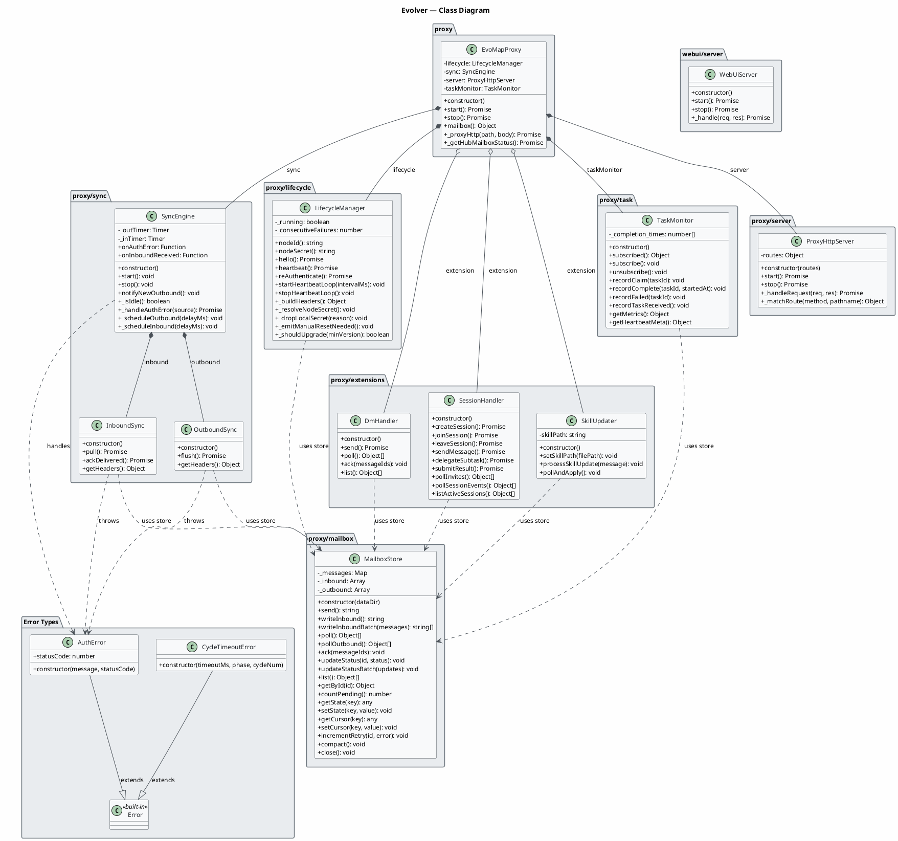

Looking at the IR, I can identify 14 classes organized across the `proxy` and `webui` subsystems. Let me generate a focused class diagram.

```plantuml
@startuml evolver_class_diagram

skinparam classAttributeIconSize 0
skinparam shadowing false
skinparam defaultFontName "Segoe UI"
skinparam defaultFontSize 12
skinparam backgroundColor #FEFEFE
skinparam class {
    BackgroundColor #F8F9FA
    BorderColor #495057
    ArrowColor #495057
    FontColor #212529
}
skinparam package {
    BackgroundColor #E9ECEF
    BorderColor #6C757D
}

title Evolver — Class Diagram

package "Error Types" {
    class Error <<built-in>>

    class CycleTimeoutError {
        +constructor(timeoutMs, phase, cycleNum)
    }

    class AuthError {
        +statusCode: number
        +constructor(message, statusCode)
    }
}

package "proxy/lifecycle" {
    class LifecycleManager {
        -_running: boolean
        -_consecutiveFailures: number
        +nodeId(): string
        +nodeSecret(): string
        +hello(): Promise
        +heartbeat(): Promise
        +reAuthenticate(): Promise
        +startHeartbeatLoop(intervalMs): void
        +stopHeartbeatLoop(): void
        +_buildHeaders(): Object
        +_resolveNodeSecret(): void
        +_dropLocalSecret(reason): void
        +_emitManualResetNeeded(): void
        +_shouldUpgrade(minVersion): boolean
    }
}

package "proxy/mailbox" {
    class MailboxStore {
        -_messages: Map
        -_inbound: Array
        -_outbound: Array
        +constructor(dataDir)
        +send(): string
        +writeInbound(): string
        +writeInboundBatch(messages): string[]
        +poll(): Object[]
        +pollOutbound(): Object[]
        +ack(messageIds): void
        +updateStatus(id, status): void
        +updateStatusBatch(updates): void
        +list(): Object[]
        +getById(id): Object
        +countPending(): number
        +getState(key): any
        +setState(key, value): void
        +getCursor(key): any
        +setCursor(key, value): void
        +incrementRetry(id, error): void
        +compact(): void
        +close(): void
    }
}

package "proxy/extensions" {
    class DmHandler {
        +constructor()
        +send(): Promise
        +poll(): Object[]
        +ack(messageIds): void
        +list(): Object[]
    }

    class SessionHandler {
        +constructor()
        +createSession(): Promise
        +joinSession(): Promise
        +leaveSession(): Promise
        +sendMessage(): Promise
        +delegateSubtask(): Promise
        +submitResult(): Promise
        +pollInvites(): Object[]
        +pollSessionEvents(): Object[]
        +listActiveSessions(): Object[]
    }

    class SkillUpdater {
        -skillPath: string
        +constructor()
        +setSkillPath(filePath): void
        +processSkillUpdate(message): void
        +pollAndApply(): void
    }
}

package "proxy/server" {
    class ProxyHttpServer {
        -routes: Object
        +constructor(routes)
        +start(): Promise
        +stop(): Promise
        +_handleRequest(req, res): Promise
        +_matchRoute(method, pathname): Object
    }
}

package "proxy/sync" {
    class SyncEngine {
        -_outTimer: Timer
        -_inTimer: Timer
        +constructor()
        +start(): void
        +stop(): void
        +notifyNewOutbound(): void
        +onAuthError: Function
        +onInboundReceived: Function
        +_isIdle(): boolean
        +_handleAuthError(source): Promise
        +_scheduleOutbound(delayMs): void
        +_scheduleInbound(delayMs): void
    }

    class InboundSync {
        +constructor()
        +pull(): Promise
        +ackDelivered(): Promise
        +getHeaders(): Object
    }

    class OutboundSync {
        +constructor()
        +flush(): Promise
        +getHeaders(): Object
    }
}

package "proxy/task" {
    class TaskMonitor {
        -_completion_times: number[]
        +constructor()
        +subscribed(): Object
        +subscribe(): void
        +unsubscribe(): void
        +recordClaim(taskId): void
        +recordComplete(taskId, startedAt): void
        +recordFailed(taskId): void
        +recordTaskReceived(): void
        +getMetrics(): Object
        +getHeartbeatMeta(): Object
    }
}

package "proxy" {
    class EvoMapProxy {
        -lifecycle: LifecycleManager
        -sync: SyncEngine
        -server: ProxyHttpServer
        -taskMonitor: TaskMonitor
        +constructor()
        +start(): Promise
        +stop(): Promise
        +mailbox(): Object
        +_proxyHttp(path, body): Promise
        +_getHubMailboxStatus(): Promise
    }
}

package "webui/server" {
    class WebUiServer {
        +constructor()
        +start(): Promise
        +stop(): Promise
        +_handle(req, res): Promise
    }
}

' Inheritance
CycleTimeoutError --|> Error : extends
AuthError --|> Error : extends

' EvoMapProxy composition
EvoMapProxy *-- LifecycleManager : lifecycle
EvoMapProxy *-- SyncEngine : sync
EvoMapProxy *-- ProxyHttpServer : server
EvoMapProxy *-- TaskMonitor : taskMonitor
EvoMapProxy o-- DmHandler : extension
EvoMapProxy o-- SessionHandler : extension
EvoMapProxy o-- SkillUpdater : extension

' SyncEngine composition
SyncEngine *-- InboundSync : inbound
SyncEngine *-- OutboundSync : outbound

' MailboxStore usage
DmHandler ..> MailboxStore : uses store
SessionHandler ..> MailboxStore : uses store
SkillUpdater ..> MailboxStore : uses store
LifecycleManager ..> MailboxStore : uses store
TaskMonitor ..> MailboxStore : uses store
InboundSync ..> MailboxStore : uses store
OutboundSync ..> MailboxStore : uses store

' AuthError usage
InboundSync ..> AuthError : throws
OutboundSync ..> AuthError : throws
SyncEngine ..> AuthError : handles

@enduml
```
